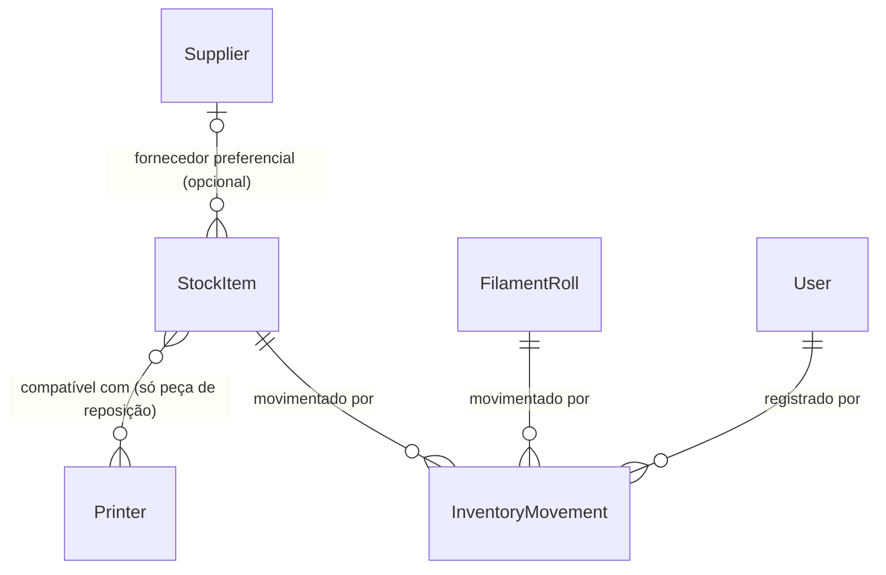

# Fase 10 — Insumos e peças de reposição

## Problem

O sistema só sabe contar filamento. Ímã, inserto roscado, parafuso, tinta, primer, cola, lixa,
embalagem, bico, placa PEI, correia, tubo PTFE e hotend não existem em lugar nenhum: não há
cadastro, saldo, custo médio nem histórico. Quem precifica digita o custo de insumos como um
valor solto (a Fase 1 recebe `supplies` como parâmetro livre, sem nenhum cadastro por trás), e
ninguém sabe, olhando o sistema, se sobrou embalagem para o pedido de amanhã ou se ainda existe
um bico de reposição na gaveta.

O `ROADMAP.md` também registra que a peça de reposição precisa saber a que impressora ela serve —
esse vínculo é o que a Fase 22 (manutenção preventiva) consome para baixar a peça certa ao
registrar a troca. Hoje esse vínculo não tem onde morar.

Quando isto for entregue: admin cadastra o item, informa a unidade de medida e registra a entrada
com custo; produção consome, lança perda e faz contagem de inventário; o custo médio ponderado
de cada item é um número que o sistema calcula a partir do ledger; e o histórico de movimentação
de insumo, peça e rolo aparece numa lista só, com quem fez e quando.

## Flow

Reaproveita o ledger `InventoryMovement` da Fase 9 (AD-022) em vez de criar um segundo ledger, e
copia dele o `UPDATE` relativo + `CHECK` contra saldo negativo (AD-023) e o contrato de
paginação (AD-020).

`single module - inventory` (existente, ganha um segundo agregado), referenciando `Supplier`
(Fase 8) e `Printer` (Fase 7) por FK — nenhuma das duas ganha coluna nova.

1. Cadastro (admin) -> `InventoryService.createItem` (new, no door - placement per convenção do
   módulo) -> valida categoria, `sku` livre e fornecedor/impressoras existentes -> persiste
   `StockItem` (door 1) com saldo `0` e, quando for peça, os vínculos de compatibilidade (door 2)
   -> **nenhum** movimento é gravado: o cadastro não é um lote (door 6)
2. Entrada com custo (admin) -> `InventoryService.addEntry` (new, no door - placement) -> grava
   `InventoryMovement` tipo `entrada` apontando para `stockItemId` em vez de `rollId` (door 3) e
   soma o saldo na mesma transação
3. Consumo / perda / contagem (produção) -> `InventoryService` (new, no door - placement, mesmo
   módulo) -> grava o movimento e atualiza `balanceQuantity` na mesma transação; a baixa decrementa
   por `UPDATE` relativo e quem estourar o saldo é rejeitado pelo `CHECK` do banco (AD-023)
4. Leitura (todos os papéis) -> `stock-item-average-cost.ts` (new, no door - placement, função
   pura ao lado de `average-cost.ts`) -> replay do ledger do item em ordem cronológica devolve
   saldo e custo médio móvel, nunca armazenados (door 5)
5. out: `GET /inventory/items`, `GET /inventory/items/:id` (com histórico) e
   `GET /inventory/movements`, que lista movimento de rolo e de item numa lista só (door 3)
6. Web: tela de itens por categoria, tela de detalhe do item com histórico e formulários, e tela
   de movimentações unificada com os rolos

## Impact

| Front | O que muda |
| --- | --- |
| domain | novo termo: `StockItem` - item controlado por quantidade (insumo ou peça de reposição), com saldo na própria unidade de medida, vive em `inventory` |
| domain | novo termo: `unitOfMeasure` - texto livre do item (`un`, `m`, `kg`, `L`, `folha`); o sistema exibe, nunca converte entre unidades |
| domain | existente: `InventoryMovement` deixa de ser "movimento de rolo" e passa a ser "movimento de estoque", com exatamente um dono (`rollId` **ou** `stockItemId`). Quem hoje assume rolo: `InventoryService` (`createRoll`, `weigh`, `addMovement`, `discard`), `GET /inventory/rolls/:id` e a tela `web/src/app/(app)/inventory/[id]/page.tsx` |
| domain | existente: `Printer` ganha o primeiro consumidor por FK, pelo vínculo de compatibilidade; nenhuma mudança de contrato no módulo `printers` |
| domain | existente: `Supplier` ganha um segundo consumidor por FK, no mesmo formato opcional do rolo |
| contrato consumido | `MovementResponse.quantityGrams` -> `quantity` e `unitCostCentsPerGram` -> `unitCostCents` (door 4). Quem lê hoje: `web/src/lib/inventory.ts`, `web/src/app/(app)/inventory/[id]/page.tsx` (corpo do POST de baixa e as duas colunas da tabela de histórico) e `page.test.tsx`. Atualizados na mesma mudança |
| stored data | `inventory_movements` existe e tem linhas: `roll_id` passa a aceitar nulo (relaxa restrição, nunca falha), as duas colunas são renomeadas preservando os valores, e o `CHECK` de dono único é satisfeito por toda linha atual (todas têm `roll_id` preenchido e `stock_item_id` nulo) - **sem backfill** |
| stored data | `stock_items` e `stock_item_printers` são tabelas novas - nada a migrar |
| doc | a linha `inventory` da "Matriz de permissões" do `ROADMAP.md` passa a citar as ações de item (entrada é admin; consumo/perda/contagem é produção) |

## Relations

One-way constraints: um `InventoryMovement` tem exatamente um dono — `rollId` **ou**
`stockItemId`, nunca os dois e nunca nenhum, reforçado por `CHECK` no banco (door 3);
`InventoryMovement.userId` continua obrigatório e sem rota de edição ou exclusão (AD-022);
`StockItem.balanceQuantity` nunca negativo, reforçado por `CHECK` no banco além da resposta `400`
da API (door 1, mesmo mecanismo do AD-023); `StockItem.sku` único quando informado, e vários
itens sem `sku` convivem (door 1, mesmo precedente de `Supplier.document`);
`StockItem.preferredSupplierId` FK opcional para `suppliers`; a compatibilidade é uma tabela de
junção com chave composta, e existe só para a categoria `peca_reposicao` (door 2). No
columns/types beyond what the doors below fix.

## Surface

Toda rota herda o guard global de sessão (AD-015) e o `RolesGuard` (AD-018); `401` sem cookie e
`403` fora do papel entram no `Status` de cada rota.

| Route | In | Out | Status |
| --- | --- | --- | --- |
| `POST /inventory/items` | `category`, `name`, `unitOfMeasure`, `sku?`, `location?`, `preferredSupplierId?`, `compatiblePrinterIds?` | `StockItemResponse` (item + `balanceQuantity`, `avgCostCents`, `compatiblePrinterIds`) | `201`, `400`, `401`, `403`, `409` |
| `PATCH /inventory/items/:id` | qualquer campo de cadastro do `POST` + `active?` | `StockItemResponse` | `200`, `400`, `401`, `403`, `404`, `409` |
| `GET /inventory/items` | query `category?`, `search?`, `page?`, `pageSize?` (AD-020) | `{ items: StockItemResponse[], total, page, pageSize }` | `200`, `400`, `401` |
| `GET /inventory/items/:id` | - | `StockItemResponse` + `movements: MovementResponse[]` | `200`, `400`, `401`, `404` |
| `POST /inventory/items/:id/entries` | `quantity`, `unitCostCents` | `StockItemResponse` | `201`, `400`, `401`, `403`, `404` |
| `POST /inventory/items/:id/movements` | `type` (`consumo` ou `perda`), `quantity`, `reason?` | `StockItemResponse` | `201`, `400`, `401`, `403`, `404` |
| `PATCH /inventory/items/:id/count` | `countedQuantity` | `StockItemResponse` | `200`, `400`, `401`, `403`, `404` |
| `GET /inventory/movements` | query `page?`, `pageSize?` (AD-020) | `{ items: MovementResponse[], total, page, pageSize }`, cada item com `rollId` ou `stockItemId` | `200`, `400`, `401` |
| `GET /inventory/rolls/:id` (assinatura muda) | - | igual, com `movements[].quantity` e `movements[].unitCostCents` renomeados (door 4) | `200`, `400`, `401`, `404` |
| `POST /inventory/rolls/:id/movements` (assinatura muda) | `type`, `quantity` (era `quantityGrams`), `reason?` | `RollResponse` | `201`, `400`, `401`, `403`, `404`, `409` |

## Landing

| One-way door | Literal shape | Alternativa rejeitada |
| --- | --- | --- |
| 1. Nova tabela `stock_items` com enum de categoria, saldo não negativo e `sku` único quando informado | `CREATE TYPE stock_items_category_enum AS ENUM('insumo','peca_reposicao')`; `stock_items(id pk default gen_random_uuid(), category stock_items_category_enum not null, name not null, sku null unique, unit_of_measure not null, location null, preferred_supplier_id null fk suppliers, balance_quantity double precision not null default 0, active boolean not null default true, created_at, updated_at, CONSTRAINT stock_item_balance_non_negative CHECK (balance_quantity >= 0))` | Reaproveitar `Material` com um campo "é insumo" - rejeitada porque `Material` carrega densidade, temperatura de bico/mesa e secagem, que não existem para um parafuso, e porque `FilamentRoll.materialId` passaria a poder apontar para um item que não é filamento |
| 2. Compatibilidade peça×impressora numa tabela de junção com chave composta | `stock_item_printers(stock_item_id fk stock_items on delete cascade, printer_id fk printers, PRIMARY KEY (stock_item_id, printer_id))` | Um `jsonb` com a lista de ids na própria `stock_items` (precedente de `printers.nozzles`) - rejeitada porque a Fase 22 precisa da pergunta inversa ("quais peças servem nesta impressora"), que sem FK nem índice vira varredura de tabela e aceita id de impressora inexistente |
| 3. `inventory_movements` passa a ter exatamente um dono: `roll_id` **ou** `stock_item_id` | `ALTER TABLE inventory_movements ALTER COLUMN roll_id DROP NOT NULL`; `ADD COLUMN stock_item_id uuid NULL REFERENCES stock_items(id)`; `ADD CONSTRAINT movement_single_owner CHECK ((roll_id IS NOT NULL) <> (stock_item_id IS NOT NULL))`; `RENAME COLUMN quantity_grams TO quantity`; `RENAME COLUMN unit_cost_cents_per_gram TO unit_cost_cents` (a unidade passa a vir do dono: grama no rolo, `unit_of_measure` no item) | Uma tabela `stock_item_movements` separada com o mesmo shape - rejeitada porque o critério de aceite do ROADMAP pede o histórico unificado com os rolos, o que passaria a exigir `UNION` em toda leitura, e porque cada tipo estocável futuro (Fase 15, produto acabado) multiplicaria as tabelas. O polimorfismo sem FK (`entity_type`/`entity_id`) segue rejeitado pelo mesmo motivo da Fase 9, door 1: perde a integridade referencial do banco. **Custo assumido:** cada novo tipo estocável acrescenta uma coluna nula e um termo ao `CHECK` — a Fase 15 paga isso uma vez |
| 4. O movimento passa a se chamar `quantity`/`unitCostCents` no contrato da API, em toda rota | `MovementResponse { id, type, quantity, unitCostCents, reason, userId, createdAt, rollId, stockItemId }`; o corpo de `POST /inventory/rolls/:id/movements` passa a receber `quantity` | Manter `quantityGrams`/`unitCostCentsPerGram` no rolo e usar `quantity`/`unitCostCents` só no item - rejeitada porque `GET /inventory/movements` devolve os dois tipos na mesma lista e o web teria de escolher a chave por linha; um nome em gramas num ledger que também conta parafuso é a fuga de nome que o `Impact` existe para pegar |
| 5. Custo médio do item é média móvel ponderada (PMP) recalculada por replay do ledger, nunca armazenada | Percorrendo os movimentos do item em `createdAt ASC, id ASC`: `entrada` faz `avg = (saldo × avg + qty × unitCostCents) / (saldo + qty)` e `saldo += qty`; `consumo`, `perda` e `ajuste` mudam só o saldo e deixam `avg` intacto; `avgCostCents` é `null` quando o saldo final é `0`. A ordem entre duas `entrada` não altera o resultado (a média ponderada delas é simétrica), e cada rota grava um único movimento, então não há empate de `createdAt` entre uma entrada e uma saída | Média ponderada simples sobre **todas** as entradas históricas do item - rejeitada pelo mesmo motivo do door 4 da Fase 9: continuaria cobrando o preço de um lote já totalmente consumido em vez do que está na prateleira. Guardar `avg_cost_cents` como coluna atualizada a cada entrada - rejeitada pelo AD-024 (custo médio nunca é armazenado) |
| 6. O cadastro do item nasce com saldo `0` e **sem** movimento; a entrada é uma segunda chamada, que é quem carrega o custo | `POST /inventory/items` -> `balanceQuantity = 0`, zero linha em `inventory_movements`; `POST /inventory/items/:id/entries` -> movimento `entrada` com `unitCostCents`. Precedente que a Fase 21 (recebimento de compra) e a Fase 15 (produto acabado) copiam | Copiar `createRoll`, que cria o cadastro e a primeira `entrada` juntos - rejeitada porque um rolo **é** o lote (tem custo de aquisição próprio) e um `StockItem` é um SKU que recebe N lotes a preços diferentes; exigir quantidade inicial no cadastro obrigaria a inventar uma entrada fictícia para cadastrar um item que ainda não chegou |

- Nada mais nesta mudança é difícil de reverter: nome de arquivo, pasta de tela, layout e textos se
  resolvem no diff.

## Criteria

### S1: Cadastro de item (P1)

Admin cadastra insumo e peça de reposição, e desativa em vez de apagar.

**Acceptance Criteria**

1. WHEN um admin envia `POST /inventory/items` com `category` igual a `insumo` ou `peca_reposicao`, `name` e `unitOfMeasure` THEN o sistema SHALL criar o `StockItem` com `balanceQuantity = 0`, `avgCostCents = null` e `active = true`, sem gravar nenhuma `InventoryMovement`, e responder `201` com o item criado
2. IF `category` não for exatamente `insumo` nem `peca_reposicao`, ou `name` ou `unitOfMeasure` vierem vazios THEN o sistema SHALL responder `400 { error }`
3. IF `sku` for enviado e já existir em outro `StockItem` THEN o sistema SHALL responder `409 { error }`
4. WHEN dois itens são criados sem `sku` THEN o sistema SHALL aceitar os dois, sem tratar os nulos como duplicados
5. IF `preferredSupplierId` for enviado e não corresponder a um fornecedor existente THEN o sistema SHALL responder `400 { error }`
6. WHEN um admin envia `PATCH /inventory/items/:id` com `active: false` THEN o sistema SHALL marcar o item como inativo mantendo a linha e o histórico, e responder `200`
7. The system SHALL não expor nenhuma rota de exclusão física de `StockItem`
8. WHEN `production` ou `sales` chama `POST /inventory/items` ou `PATCH /inventory/items/:id` THEN o sistema SHALL responder `403`
9. WHEN `GET /inventory/items` é chamado com `category=peca_reposicao` THEN o sistema SHALL retornar só as peças de reposição, no contrato `{ items, total, page, pageSize }` com `page` default `1` e `pageSize` default `20` (AD-020)
10. WHEN `GET /inventory/items` é chamado com `search` THEN o sistema SHALL retornar os itens cujo `name` ou `sku` contenha o termo, sem diferenciar maiúsculas de minúsculas
11. WHEN `GET /inventory/items` é chamado por `production` ou `sales` THEN o sistema SHALL responder `200`

**Independent test:** cadastrar um insumo e uma peça, repetir o `sku` e desativar um deles.

### S2: Entrada com custo e custo médio ponderado (P1)

Admin registra a chegada do item com o custo pago, e o sistema passa a saber a quanto sai a
unidade hoje.

**Acceptance Criteria**

12. WHEN um admin envia `POST /inventory/items/:id/entries` com `quantity > 0` e `unitCostCents >= 0` THEN o sistema SHALL gravar uma `InventoryMovement` tipo `entrada` com `stockItemId` preenchido, `rollId` nulo, `quantity` positivo e `unitCostCents` igual ao enviado, somar `quantity` ao `balanceQuantity` na mesma transação, e responder `201`
13. IF `quantity <= 0` ou `unitCostCents < 0` THEN o sistema SHALL responder `400 { error }` sem gravar nada
14. WHEN um item recebe uma entrada de `100` a `50` centavos e depois uma de `100` a `70` centavos THEN `GET /inventory/items/:id` SHALL retornar `balanceQuantity = 200` e `avgCostCents = 60` (caso de referência)
15. WHEN um consumo de `150` é registrado depois das duas entradas do AC 14 THEN `avgCostCents` SHALL continuar `60` e `balanceQuantity` SHALL ser `50` — uma saída nunca altera o custo médio
16. WHEN uma terceira entrada de `50` a `100` centavos é registrada depois do consumo do AC 15 THEN `avgCostCents` SHALL ser `80`, a média móvel sobre o saldo remanescente (door 5)
17. IF `balanceQuantity` do item é `0` THEN `avgCostCents` SHALL ser `null`
18. IF o item está inativo THEN `POST /inventory/items/:id/entries` SHALL responder `400 { error }`
19. WHEN `production` ou `sales` chama `POST /inventory/items/:id/entries` THEN o sistema SHALL responder `403`

**Independent test:** duas entradas a preços diferentes, um consumo e uma terceira entrada, comparando o custo médio com os valores 60, 60 e 80.

### S3: Consumo e perda (P1)

Produção registra o que saiu, e o saldo nunca fica negativo.

**Acceptance Criteria**

20. WHEN produção envia `POST /inventory/items/:id/movements` com `type` `consumo` ou `perda` e `quantity > 0` que não excede o saldo THEN o sistema SHALL gravar a `InventoryMovement` com `quantity` negativo e `unitCostCents` nulo, decrementar `balanceQuantity` na mesma transação, e responder `201`
21. IF `quantity` excede o `balanceQuantity` do item THEN o sistema SHALL responder `400 { error }` sem gravar movimento, decidido pelo `CHECK (balance_quantity >= 0)` do banco sobre um `UPDATE` relativo, nunca por uma pré-checagem em memória (AD-023)
22. WHEN duas baixas concorrentes do mesmo item, cada uma válida isoladamente, juntas excederiam o saldo THEN o sistema SHALL aceitar exatamente uma e responder `400 { error }` à outra
23. IF `type` for `entrada` ou `ajuste` em `POST /inventory/items/:id/movements` THEN o sistema SHALL responder `400 { error }` (entrada nasce em `/entries` e ajuste em `/count`)
24. WHEN `sales` chama `POST /inventory/items/:id/movements` THEN o sistema SHALL responder `403`

**Independent test:** consumir parte do saldo, tentar consumir mais do que existe e disparar duas baixas concorrentes.

### S4: Contagem de inventário (P2)

Produção conta a gaveta e o sistema grava a diferença como ajuste, do mesmo jeito que a pesagem
do rolo.

**Acceptance Criteria**

25. WHEN produção envia `PATCH /inventory/items/:id/count` com `countedQuantity >= 0` THEN o sistema SHALL gravar uma `InventoryMovement` tipo `ajuste` com `quantity = countedQuantity - balanceQuantity atual` (podendo ser negativo), atualizar `balanceQuantity = countedQuantity`, e responder `200`
26. WHEN `countedQuantity` é igual ao saldo atual THEN o sistema SHALL gravar o `ajuste` com `quantity = 0`, registrando que a contagem aconteceu
27. IF `countedQuantity < 0` THEN o sistema SHALL responder `400 { error }`
28. WHEN `sales` chama `PATCH /inventory/items/:id/count` THEN o sistema SHALL responder `403`

**Independent test:** contar um item com saldo 50 informando 45 e conferir o ajuste de −5 no histórico.

### S5: Compatibilidade da peça com impressoras (P2)

A peça de reposição sabe em que impressora ela serve, e o insumo não carrega esse vínculo.

**Acceptance Criteria**

29. WHEN um admin envia `POST /inventory/items` com `category = peca_reposicao` e `compatiblePrinterIds` com dois ids válidos THEN o sistema SHALL gravar um vínculo por impressora e retornar os dois ids em `compatiblePrinterIds`
30. IF `compatiblePrinterIds` for enviado com `category = insumo` THEN o sistema SHALL responder `400 { error }`
31. IF algum id de `compatiblePrinterIds` não corresponder a uma impressora existente THEN o sistema SHALL responder `400 { error }` sem gravar nenhum vínculo
32. WHEN `PATCH /inventory/items/:id` envia `compatiblePrinterIds` THEN o sistema SHALL substituir o conjunto de vínculos pelo enviado, removendo os que não estiverem na lista
33. WHEN `compatiblePrinterIds` é omitido no `PATCH` THEN o sistema SHALL manter os vínculos existentes

**Independent test:** cadastrar um bico compatível com duas impressoras, trocar por uma e conferir o conjunto final.

### S6: Ledger único, histórico unificado e auditoria (P1)

Movimento de rolo e movimento de item vivem na mesma tabela, aparecem na mesma lista e sempre
dizem quem fez.

**Acceptance Criteria**

34. WHEN `GET /inventory/movements` é chamado THEN o sistema SHALL retornar movimentos de rolo e de item numa lista só, ordenada por `createdAt` decrescente, paginada no contrato AD-020, cada um com `type`, `quantity`, `unitCostCents`, `reason`, `userId`, `createdAt` e exatamente um de `rollId` ou `stockItemId` preenchido
35. WHEN `GET /inventory/items/:id` é chamado THEN o sistema SHALL retornar o item com `balanceQuantity`, `avgCostCents`, `compatiblePrinterIds` e `movements` ordenados por `createdAt` crescente
36. The system SHALL gravar o `userId` de quem fez a chamada em toda `InventoryMovement` de item, sem exceção
37. IF uma gravação em `inventory_movements` tiver `rollId` e `stockItemId` ambos preenchidos, ou ambos nulos THEN o banco SHALL rejeitar a linha pelo `CHECK` de dono único (door 3)
38. WHEN `GET /inventory/rolls/:id` é chamado depois desta fase THEN cada movimento do histórico SHALL vir com as chaves `quantity` e `unitCostCents`, e SHALL não conter `quantityGrams` nem `unitCostCentsPerGram` (door 4)
39. WHEN um rolo é criado, pesado e baixado depois desta fase THEN os valores gravados no ledger SHALL ser os mesmos de antes da renomeação (entrada positiva com custo por grama, ajuste assinado, baixa negativa)
40. The system SHALL continuar sem expor rota de edição ou exclusão de `InventoryMovement`, de rolo ou de item (AD-022)

**Independent test:** movimentar um rolo e um item e conferir as duas linhas na lista unificada, com dono e usuário.

### S7: Telas de insumos, peças e movimentações (P1)

Web: lista por categoria, detalhe com histórico e formulários, e a lista unificada de
movimentações.

**Acceptance Criteria**

41. WHEN a tela de insumos e peças carrega THEN o sistema SHALL mostrar um estado de carregamento e, ao concluir, a lista filtrável por categoria com `name`, `unitOfMeasure`, saldo e custo médio de cada item
42. IF a chamada à API falhar THEN a tela SHALL mostrar um estado de erro com a ação de tentar novamente, sem lista parcial
43. IF não houver nenhum item cadastrado THEN a tela SHALL mostrar um estado vazio com a ação de cadastrar, visível só para admin
44. WHEN `production` ou `sales` está logado THEN a tela de lista SHALL esconder as ações de cadastrar e de registrar entrada (só admin)
45. WHEN `sales` está logado THEN a tela de detalhe do item SHALL esconder os formulários de consumo, perda e contagem, ficando só leitura
46. WHEN a tela de detalhe do item carrega THEN o sistema SHALL mostrar saldo, custo médio, as impressoras compatíveis (quando for peça) e o histórico de movimentações com usuário e data
47. WHEN a tela de movimentações carrega THEN o sistema SHALL mostrar os movimentos de rolo e de item na mesma tabela, identificando o dono de cada linha, com estados de carregamento, erro e vazio
48. WHEN a tela de detalhe do rolo carrega depois desta fase THEN as colunas de quantidade e custo do histórico SHALL continuar preenchidas, lendo as chaves renomeadas (door 4)
49. WHEN o usuário pede para desativar um item THEN a tela SHALL exigir uma confirmação explícita antes de enviar o `PATCH`, no mesmo `ConfirmDialog` que o descarte de rolo usa (AD-021)

**Independent test:** validado com Playwright — carregamento, vazio, erro, papéis, e a tela do rolo ainda correta depois da renomeação.

## Out of scope

| Excluído | Por quê |
| --- | --- |
| Estoque mínimo, alertas de reposição e etiqueta QR | Fase 11 do ROADMAP |
| Entrada por pedido de compra com rateio de frete e impostos | Fase 21 do ROADMAP - a entrada desta fase é sempre manual |
| Baixa de peça ao registrar manutenção, e a consulta "quais peças servem nesta impressora" | Fase 22 do ROADMAP - esta fase só grava o vínculo de compatibilidade |
| Estoque de produto acabado ligado a produto/variação | Fase 15 do ROADMAP - é o terceiro dono do ledger, e paga a coluna nula do door 3 quando chegar |
| A calculadora passar a puxar o custo médio de insumo do cadastro | Fase 12 do ROADMAP - hoje o `pricing` recebe insumo como parâmetro solto |
| Conversão entre unidades de medida (comprar em kg e consumir em g) | O `unitOfMeasure` é texto de exibição; nenhuma tela ou cálculo desta fase converte unidade |
| Edição ou estorno de um movimento já gravado | Ledger imutável (AD-022); a correção acontece por contagem de inventário (S4) |
| Filtro de `GET /inventory/movements` por dono, tipo ou período | Nenhum consumidor nesta fase; o histórico por dono já vem em `GET /inventory/items/:id` e `GET /inventory/rolls/:id` |

## Assumptions

| Assumption | Chosen default | Rationale | Confirmed? |
| --- | --- | --- | --- |
| `unitOfMeasure` é enum fechado ou texto livre | Texto livre (1 a 20 caracteres) | A lista de itens do CONTEXT é aberta (ímã, tinta, lixa, embalagem, correia, PTFE) e o sistema nunca faz aritmética com a unidade, só exibe; um enum fechado seria um door para ganhar nada | n |
| Quantidade é inteira ou fracionária | Fracionária, como o saldo do rolo | Tinta em litro e tubo em metro admitem 0,5; um `@IsInt` bloquearia isso sem necessidade | n |
| Papéis das ações de item | Entrada (carrega custo) é admin; consumo, perda e contagem são produção; leitura é para os três | Exatamente o corte da Fase 9, confirmado pelo usuário: dado financeiro fica com admin, ação de chão de fábrica tem rota dedicada para produção | n |
| Item inativo e movimentação | Inativo bloqueia só a entrada (AC 18); consumo, perda e contagem continuam liberados | Desativar é "não comprar mais isto", e o saldo que ficou na gaveta ainda precisa poder ser zerado; mesma lógica do material inativo bloqueando rolo novo na Fase 9 | n |
| Onde as telas de item moram | `/inventory/items` e `/inventory/items/[id]`, ao lado do detalhe de rolo em `/inventory/[id]` | Segmento estático tem precedência sobre segmento dinâmico no App Router, então `/inventory/items` não cai no `[id]` do rolo; a alternativa (`/stock-items`) separaria no menu duas coisas que o ROADMAP trata como um módulo. A precedência será reconfirmada na documentação local do Next durante o build | n |
| Texto do menu lateral | "Estoque" passa a "Filamento", e entram "Insumos e peças" e "Movimentações" | Com dois tipos de estoque, um item chamado "Estoque" que abre só filamento passa a mentir | n |
| Contagem com saldo igual grava movimento | Sim, `ajuste` com `quantity = 0` (AC 26) | Mesma escolha da pesagem da Fase 9, que sempre grava o ajuste: a contagem em si é o fato auditável, mesmo sem diferença | n |
| Movimento de item carrega `reason` | Sim, opcional, no mesmo campo do rolo | A coluna já existe no ledger e "perda" sem motivo é o que a Fase 22 e a Fase 27 vão querer ler | n |

**Open questions:** none - all resolved or logged above.

## Observable

| Surface | Decision | Landing |
| --- | --- | --- |
| screen `items list` | loading state | AC 41 |
| screen `items list` | error state | AC 42 |
| screen `items list` | empty state | AC 43 |
| screen `items list` | unauthorised state | n/a - a rota já exige sessão (AD-015) e os três papéis podem ler |
| screen `items list` | densidade e ordenação | AC 41 - filtrável por categoria, ordenada por `name` |
| screen `items list` | ação destrutiva confirma antes | n/a - a desativação fica no detalhe, e nada nesta tela apaga |
| screen `item detail` | loading state | AC 41 (mesmo padrão da lista) |
| screen `item detail` | error state | AC 42 (mesmo padrão da lista) |
| screen `item detail` | empty state | AC 46 - item recém-cadastrado tem histórico vazio (door 6), a tela mostra o vazio do histórico |
| screen `item detail` | unauthorised state | n/a - mesma regra da lista |
| screen `item detail` | ação destrutiva confirma antes | AC 49 - desativação pelo `ConfirmDialog` (AD-021), o mesmo componente do descarte de rolo |
| screen `movements` | loading, error e empty | AC 47 |
| screen `movements` | densidade e ordenação | AC 34 - `createdAt` decrescente, paginada |
| screen `roll detail` (existente) | não regride com a renomeação | AC 48 |
| all `/inventory/items*`, `/inventory/movements` | formato e códigos de erro | AD-001; ACs 2, 3, 5, 13, 21, 23, 27, 30, 31 |
| all `/inventory/items*`, `/inventory/movements` | quem pode chamar | ACs 8, 11, 19, 24, 28, 44, 45 |
| all `/inventory/items*`, `/inventory/movements` | versionamento, rate limit | n/a - nenhum módulo do sistema versiona rota nem aplica rate limit |
| command ou scheduled task | - | n/a - nenhum comando ou job nesta fase |
| documento ou copy | - | n/a - nenhum texto de leitura externa nesta fase |
| coleção `stock items` | critério de agrupamento | AC 9/41 - por `category` |
| coleção `stock items` | nomeação | AC 1 - `name` obrigatório e `sku` opcional |
| coleção `stock items` | duplicados | AC 3/4 - `sku` único quando informado, e vários itens sem `sku` convivem |
| coleção `stock items` | exceção que não se encaixa | AC 30 - só `peca_reposicao` aceita compatibilidade; insumo com `compatiblePrinterIds` é `400` |
| coleção `movements` | critério de agrupamento e exceção | AC 34/37 - um dono por linha, garantido pelo `CHECK` |

## Sources

- `ROADMAP.md` Fase 10 (Insumos e peças de reposição) - objetivo, tarefas e critérios de aceite
- `.specs/STATE.md` AD-020 (paginação), AD-021 (componentes CRUD), AD-022 (ledger imutável e saldo materializado, que prevê esta fase), AD-023 (decremento concorrente + `CHECK`) e AD-024 (custo médio nunca armazenado)
- `.specs/features/phase-9-filament-inventory/plan.md` - doors 1 a 6, de onde vêm o shape do ledger e o corte de papéis que esta fase copia
