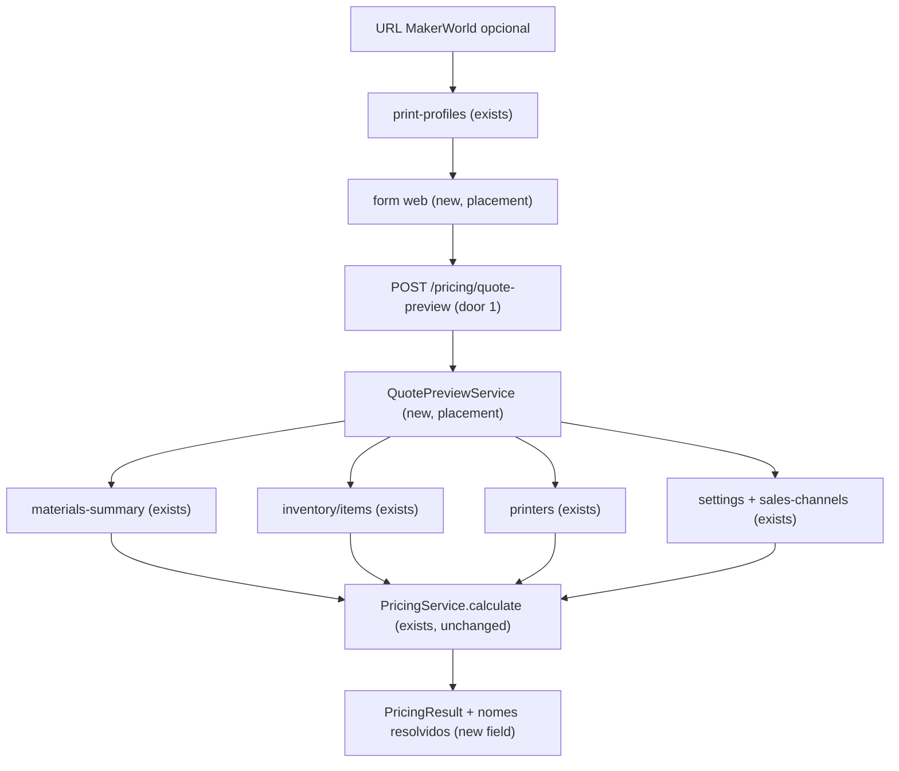

# Fase 12 — Calculadora integrada

## Problem

Hoje `POST /pricing/calculate` (Fase 1) já calcula o custo detalhado e o preço por canal
corretamente, e `POST /print-profiles/import` (Fase 2) já traz tempo e gramas por filamento de
uma URL do MakerWorld. Mas os dois ficam isolados: quem precisa de um orçamento tem que digitar à
mão o custo por grama de cada material, o custo por unidade de cada insumo, a potência e o custo
da impressora e as tarifas do canal - todos valores que já estão cadastrados no sistema (Fases 5,
6, 7, 9, 10) ou disponíveis pela Fase 2. Sem essa integração, o "diferencial" do CONTEXT.md (a
calculadora) não é usável na operação: cada orçamento exige reconferir manualmente números que o
sistema já sabe, e um custo médio que muda (nova entrada de rolo) não se reflete em nada até
alguém digitar de novo.

Depois desta fase, quem for precificar um trabalho abre uma tela, opcionalmente cola a URL do
MakerWorld para preencher tempo e filamentos, escolhe a impressora e mapeia cada filamento para
um material cadastrado (e os insumos, se houver), e vê o custo detalhado e o preço por canal na
hora - usando o custo médio *atual* de cada material e insumo, sem reescrever a fórmula.

## Flow

Reaproveita `PricingService.calculate` (Fase 1, puro, sem alteração) como motor do cálculo,
`GET /inventory/materials-summary` e `GET /inventory/items` (Fase 9/10, AD-024) como única fonte
de custo médio, e `POST /print-profiles/import` (Fase 2) como preenchimento opcional de tempo e
filamentos. Nenhum desses três é modificado.

1. Web: usuário abre `/pricing` e, opcionalmente, cola a URL do MakerWorld -> `print-profiles`
   (exists) devolve tempo e filamentos, que preenchem o formulário (reaproveita a lógica de
   `PrintProfileImport`, Fase 2, exists)
2. Web (new, no door - placement per conventions): usuário escolhe a impressora (lista de
   `printers`, exists), mapeia cada filamento para um `Material` cadastrado e cada insumo para
   um `StockItem` cadastrado, informa horas de mão de obra, quantidade e os canais a comparar
3. Web -> `POST /pricing/quote-preview` (door 1) com ids e quantidades
4. `QuotePreviewService` (new, no door - placement per conventions, dentro de `pricing` module)
   busca em paralelo: `Material` e seu custo médio via `InventoryService.materialsSummary`
   (exists), `StockItem` e seu custo médio via `InventoryService.listItems` (exists), `Printer`
   via `PrintersService` (exists, usa `toPricingPrinterInput`, exists), `Settings` e
   `SalesChannel[]` via `SettingsService` (exists)
5. `QuotePreviewService` (new) monta um `PricingInput` (Fase 1, exists, sem alteração) e chama
   `PricingService.calculate` (exists, puro, sem alteração)
6. out: `PricingResult` (Fase 1, exists) mais os nomes resolvidos (material, insumo, impressora,
   canal) para a tela não precisar buscá-los de novo

## Impact

| Front | What changes |
| --- | --- |
| domain | novo termo: "prévia de orçamento" (`quote preview`) - um cálculo de `pricing` com os parâmetros resolvidos a partir de cadastros em vez de digitados; não persiste nada, então não é ainda o `Quote` da Fase 16 |
| domain | termo existente: `PricingInput`/`PricingResult` (Fase 1) - continuam significando exatamente o mesmo (o contrato puro não muda); o que muda é quem os monta (antes: só o corpo bruto da requisição; agora: também o novo serviço de aplicação a partir de ids) |
| stored data | nada a migrar - nenhuma entidade nova, nenhuma coluna nova |

## Relations

`None - no stored-data shape change`

## Surface

| Route | In | Out | Status |
| --- | --- | --- | --- |
| `POST /pricing/quote-preview` | `printerId`, `materials: [{materialId, grams}]`, `supplies: [{stockItemId, quantity}]`, `printHours`, `labor: {prepHours, slicingHours, postProcessingHours}`, `quantity`, `channelIds: string[]`, `minimumOrderCents?` | `PricingResult` (Fase 1) + `printer: {id, name}`, `materials: [{materialId, name, avgCostCentsPerGram}]`, `supplies: [{stockItemId, name, avgCostCents}]`, `channels: [{id, name}]` | `200`, `400`, `404` |

## Landing

| One-way door | Literal shape | Alternative rejected |
| --- | --- | --- |
| `POST /pricing/quote-preview` recebe **ids** (material/impressora/insumo/canal), nunca os valores brutos de custo | contrato de entrada: `{ printerId: string, materials: { materialId: string, grams: number }[], supplies: { stockItemId: string, quantity: number }[], printHours: number, labor: {...}, quantity: number, channelIds: string[], minimumOrderCents?: number }` | aceitar o `CalculatePricingDto` bruto (Fase 1) com um `materialId` opcional por item - rejeitado porque duplicaria a validação de custo em dois lugares e reabriria a porta para o cliente mandar um custo que não é o do cadastro, o que o AD-024 fecha |

- Nada mais neste change é difícil de reverter: o serviço de aplicação, o mapeamento
  filamento→material na tela e o formato de resposta são todos ajustáveis num refactor comum.

## Criteria

### S1: prévia de orçamento a partir de cadastros (P1)

Um usuário autenticado monta um cálculo escolhendo impressora, materiais e insumos já
cadastrados, e recebe o custo detalhado e o preço por canal calculados com o custo médio atual.

**Acceptance Criteria**

1. WHEN `POST /pricing/quote-preview` recebe `printerId`, `materials[]` (`materialId`, `grams`), horas, mão de obra, quantidade e `channelIds[]` válidos THEN o sistema SHALL devolver `200` com o shape de `PricingResult` (Fase 1) calculado com o custo médio atual de cada material (`GET /inventory/materials-summary`) e os dados da impressora (`toPricingPrinterInput`)
2. WHEN um material da lista tem `avgCostCentsPerGram` igual a `null` (nenhum rolo com saldo, AD-024) THEN o sistema SHALL responder `400` com `{ "error": "Material sem custo médio disponível: <nome>" }` em vez de calcular com custo zero
3. WHEN um insumo da lista tem `avgCostCents` igual a `null` (nenhuma entrada no ledger, AD-024) THEN o sistema SHALL responder `400` com `{ "error": "Insumo sem custo médio disponível: <nome>" }`
4. IF `printerId`, algum `materialId`, algum `stockItemId` ou algum `channelId` não existe THEN o sistema SHALL responder `404` com `{ "error": "<Entidade> não encontrado(a)" }` citando qual id falhou
5. IF os parâmetros resolvidos violam uma regra do `pricing` puro (ex.: margem + impostos + taxa do canal ≥ 100%, Fase 1) THEN o sistema SHALL responder `400` com a mensagem do `PricingError` (mesmo tratamento do `POST /pricing/calculate`, AD-008)
6. WHEN a resposta é `200` THEN o sistema SHALL incluir, junto do `PricingResult`, o nome resolvido de cada material, insumo, impressora e canal usados, para a tela exibir sem segunda consulta
7. WHEN um usuário com papel `production` ou `sales` chama a rota THEN o sistema SHALL responder `200` nas mesmas condições que `admin` (mesma política de `POST /pricing/calculate`, Fase 1)

**Independent test:** chamar a rota com fixtures de material/impressora/canal cadastrados via
helper de teste e comparar a resposta com o cálculo manual do `PricingService.calculate` para o
mesmo `PricingInput` resolvido.

### S2: tela da calculadora usando a URL do MakerWorld e os cadastros (P1)

A tela criada na Fase 2 (`PrintProfileImport`) passa a alimentar a calculadora: o que veio da URL
preenche tempo e filamentos, e o usuário liga cada filamento a um material cadastrado antes de
calcular.

**Acceptance Criteria**

8. WHEN o usuário cola uma URL do MakerWorld válida na tela `/pricing` THEN o sistema SHALL preencher o tempo de impressão e a lista de filamentos (tipo, cor, gramas) como a Fase 2 já faz, e exibir para cada filamento um seletor de `Material` cadastrado
9. WHEN o usuário não cola nenhuma URL THEN o sistema SHALL permitir montar a lista de materiais e insumos manualmente, cada linha com um seletor do cadastro (nunca campo de custo livre)
10. WHEN o usuário seleciona uma impressora cadastrada THEN o sistema SHALL usar o nome dela nas linhas do formulário e nunca aceitar um nome de impressora digitado à mão para o cálculo
11. WHEN o usuário clica em "Calcular" com todos os campos obrigatórios preenchidos THEN o sistema SHALL chamar `POST /pricing/quote-preview` e exibir o custo detalhado por componente e o preço de cada canal escolhido
12. WHILE a chamada ao `pricing` está em andamento the sistema SHALL exibir um indicador de carregamento e desabilitar o botão "Calcular"
13. IF `POST /pricing/quote-preview` responde `400` ou `404` THEN o sistema SHALL exibir a mensagem de erro (`role="alert"`) sem apagar o formulário preenchido
14. WHEN o usuário muda a quantidade THEN o sistema SHALL permitir recalcular sem perder o restante do formulário (nova chamada à mesma rota)
15. WHEN não existe nenhum material, impressora, insumo ou canal cadastrado (ativo) THEN o sistema SHALL exibir um estado vazio no seletor correspondente, orientando a cadastrar antes de calcular, em vez de um seletor sem opções e sem explicação

**Independent test:** com fixtures de material/impressora/canal cadastrados no ambiente de
desenvolvimento, importar a URL de exemplo do fixture da Fase 2, mapear o filamento para um
material, calcular e comparar o preço exibido com o valor do teste da S1.

## Out of scope

| Excluded | Why |
| --- | --- |
| Persistir a prévia como orçamento (`Quote`) | é a Fase 16; esta fase só calcula, não guarda |
| Detecção automática de material pelo tipo/cor do filamento do MakerWorld (ex.: casar "PLA #FD8008" com um `Material` cadastrado automaticamente) | o ROADMAP pede "mapeamento" (ação do usuário), não correspondência automática; heurística de cor é um problema separado e arriscado (cores próximas, marcas diferentes) |
| Simulação de desconto por quantidade com faixas percentuais | a fórmula da Fase 1 já dilui preparo/fatiamento por quantidade; faixas adicionais são a questão em aberto 7 do ROADMAP, não decidida |
| Adicionar `hourmeterHours` da impressora ao cálculo | a Fase 1 não usa horímetro no `PricingInput`; fora do escopo desta integração |

## Assumptions

| Assumption | Chosen default | Rationale | Confirmed? |
| --- | --- | --- | --- |
| Papéis que podem chamar `POST /pricing/quote-preview` | `production` e `sales` explícitos (mesma linha que `POST /pricing/calculate`, admin herda) | a matriz de permissões (ROADMAP) já decidiu isso para `pricing` inteiro na Fase 4; esta rota é a mesma família | n |
| Formato de erro para custo médio ausente (`null`) | `400` com nome do material/insumo na mensagem, em vez de calcular com zero ou de ignorar o item | calcular com zero mascararia um estoque zerado e passaria um custo enganoso para o preço; a rota é síncrona e sem revisão humana antes de mostrar o preço | n |
| A rota aceita `channelIds` (referência a `SalesChannel` cadastrado) e não `ChannelInput` bruto | os canais já são cadastro da Fase 5; digitar `feeRate` de novo duplicaria a fonte de verdade | mesma razão do door 1 (ids em vez de valores brutos) | n |

**Open questions:** none - todas as três acima são decisões técnicas resolvidas pelo código e
convenções existentes (AD-018 para papéis, AD-024 para custo ausente, AD-020/door do Landing para
ids vs. valores brutos), registradas como assumption porque nenhuma tem mais de uma leitura
defensável dado o que já está decidido no projeto - não são áreas cinzentas que exigem escolha do
usuário.

## Observable

| Surface | Decision | Landing |
| --- | --- | --- |
| tela `/pricing` | estado vazio (nenhum material/impressora/insumo/canal cadastrado) | AC 15 |
| tela `/pricing` | estado de carregamento (chamando `quote-preview`) | AC 12 |
| tela `/pricing` | estado de erro (400/404 do `quote-preview`) | AC 13 |
| tela `/pricing` | estado de carregamento/erro/vazio da importação por URL | existente - reaproveita `PrintProfileImport` (Fase 2), sem mudança |
| tela `/pricing` | ação destrutiva a confirmar | n/a - não há exclusão nem ação irreversível nesta tela (não persiste nada) |
| API `POST /pricing/quote-preview` | forma do erro e códigos | AC 2, 3, 4, 5 |
| API `POST /pricing/quote-preview` | quem pode chamar | AC 7 |
| API `POST /pricing/quote-preview` | versionamento, rate limit | n/a - mesma política de todo o resto da API hoje (nenhuma rota tem versionamento ou rate limit próprio) |

## Sources

- `CONTEXT.md` (seção 4, "Calculadora de preço e orçamentos") - define a fórmula e a intenção
  de reuso entre orçamento/catálogo/relatórios
- `ROADMAP.md` (Fase 12) - objetivo, dependências (Fases 1, 2, 5, 7, 9, 10) e critérios de aceite
  desta fase
- `.specs/STATE.md` AD-024 - fixa que o custo médio nunca é armazenado e que a Fase 12 deve
  consumir `GET /inventory/materials-summary`/`GET /inventory/items` em vez de cachear
