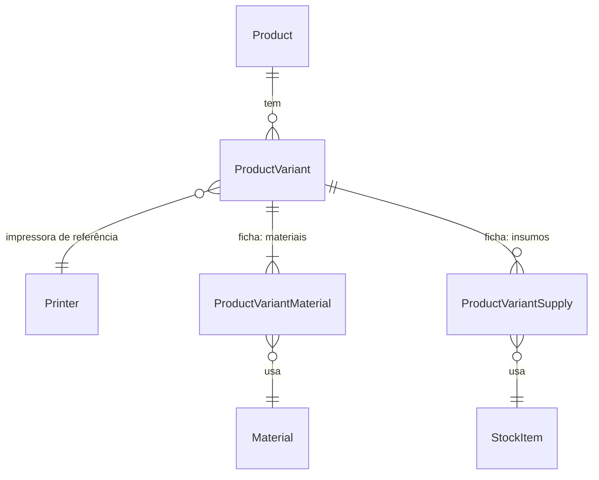

# Fase 13 — Catálogo e ficha técnica

## Problem

Hoje o sistema só precifica um trabalho de cada vez: na tela `/pricing` (Fase 12), alguém escolhe
impressora, materiais, gramas, horas e insumos, vê o preço e, ao sair da tela, perde tudo. Uma
peça que a empresa vende sempre (um chaveiro, um vaso em três cores) precisa ser remontada do zero
a cada consulta de preço, e quem está no balcão ou respondendo no Instagram depende de lembrar ou
anotar fora do sistema de quantos gramas e de quanto tempo cada versão precisa. O sistema também
não sabe de onde veio o modelo nem sob que licença, então uma peça cujo autor proíbe uso comercial
pode ser vendida sem que ninguém perceba.

O ROADMAP não traz números (volume de produtos, frequência de consulta). A dependência é
estrutural: as Fases 15 (estoque de acabados) e 16 (orçamentos) referenciam produto e variação.

Depois desta fase, o produto fica cadastrado uma vez, com a URL do modelo, a licença e uma ficha
técnica por variação. O custo e o preço sugerido de cada variação aparecem no detalhe do produto,
sempre calculados com o custo médio atual do filamento, e uma licença não comercial aparece como
aviso.

## Flow

Reaproveita `QuotePreviewService.preview` (Fase 12) como único caminho da ficha técnica até o
`pricing`. A ficha é traduzida num `CreateQuotePreviewDto`, e o serviço resolve custo médio,
impressora, configurações e canais sem uma segunda cópia dessa lógica. Também reaproveita
`parseMakerWorldUrl` (Fase 2) para o domínio do MakerWorld e `PrintProfileImport` (Fase 2) para
pré-preencher a ficha.

1. Web `/products` -> `GET /products` (door 2) -> `ProductsModule` (door 1): lista paginada (AD-020)
2. Web `/products/new` e o formulário do produto -> `POST /products` / `PATCH /products/:id`
   (door 2) -> `ProductsModule` (door 1) valida a URL e a normaliza pelo parser da plataforma
   (`parseMakerWorldUrl` existe; os de Printables e Thingiverse são placement) e grava `Product`
   com `model_platform` e `model_external_id` (door 3). Os metadados são digitados à mão
3. Web: editor de variação (placement) -> `POST /products/:id/variants` (door 2) /
   `PATCH /products/:id/variants/:variantId` (door 2). `ProductsModule` confere cada `materialId`,
   `stockItemId` e `printerId` por `MaterialsService.getById`, `InventoryService.getItemById` e
   `PrintersService.getById` (existem, exportados), e grava `ProductVariant` e as linhas da ficha
   (door 4)
4. No editor de variação, `PrintProfileImport` (exists) recebe a URL do produto quando a
   plataforma é o MakerWorld e preenche horas e linhas de filamento pelo `onFilamentsChange`
   (existe), como em `/pricing`
5. Web `/products/[id]` -> `GET /products/:id/pricing` (door 2) -> `ProductsModule` monta, por
   variação ativa, um `CreateQuotePreviewDto` com `quantity: 1`, os canais ativos
   (`SalesChannelsService.list`, existe) e `labor.centsPerHour` de `SettingsService.get`
   (existe). Depois chama `QuotePreviewService.preview` (existe; passa a ser exportado pelo
   `PricingModule`)
6. out: `{ variants: [{ variantId, name, pricing | null, error | null }] }`. Não persiste nada
   (AD-024)

## Impact

| Front | What changes |
| --- | --- |
| domain | novo termo: `Product` - peça de catálogo que aponta para a URL de um modelo em Printables, MakerWorld ou Thingiverse. Fica em `products` |
| domain | novo termo: `ProductVariant` - versão vendável de um produto (cor, tamanho) com a própria ficha técnica. As Fases 15 e 16 passam a referenciá-la |
| domain | novo termo: ficha técnica (`tech sheet`) - impressora de referência, horas de impressão, horas de preparo, fatiamento e pós-processamento, materiais com gramas e insumos com quantidades, guardados na variação |
| domain | termo existente: `QuotePreviewService` (Fase 12) - hoje só o controller de `pricing` o chama. Passa a ser exportado e chamado por `products`, sem mudar de assinatura nem de comportamento |
| domain | termo existente: `products` na matriz de permissões (ROADMAP, Fase 4) - hoje "a definir na Fase 13", e esta fase decide o valor |
| stored data | nada a migrar: quatro tabelas novas e vazias, sem mudança em tabela existente |

## Relations

Restrições de mão única:
- (`model_platform`, `model_external_id`) é único em `Product` (door 3)
- o nome da variação é único dentro do produto, sem diferenciar maiúsculas (door 4)
- produto e variação nunca são apagados, só desativados (door 4)
- as FKs para `Material`, `StockItem` e `Printer` usam `RESTRICT` (door 4)

## Surface

| Route | In | Out | Status |
| --- | --- | --- | --- |
| `GET /products` | `page`, `pageSize`, `search`, `platform` | `{ items: ProductSummary[], total, page, pageSize }` | `200`, `400`, `401` |
| `POST /products` | `name`, `description?`, `modelUrl`, `modelTitle?`, `modelImageUrl?`, `modelDesigner?`, `modelLicense?`, `commercialUseAllowed?` | `Product` (com `modelUrl` canônica, `modelPlatform`, `variants: []`) | `201`, `400`, `401`, `403`, `409` |
| `GET /products/:id` | `id` | `Product` com `variants[]`, cada uma com a ficha e os nomes resolvidos | `200`, `400`, `401`, `404` |
| `PATCH /products/:id` | os campos de `POST`, todos opcionais, mais `active` | `Product` | `200`, `400`, `401`, `403`, `404`, `409` |
| `POST /products/:id/variants` | `name`, `printerId`, `printHours`, `prepHours`, `slicingHours`, `postProcessingHours`, `materials: [{materialId, grams}]`, `supplies: [{stockItemId, quantity}]` | `ProductVariant` | `201`, `400`, `401`, `403`, `404`, `409` |
| `PATCH /products/:id/variants/:variantId` | os campos de `POST`, todos opcionais, mais `active`. `materials`/`supplies` enviados substituem a lista inteira | `ProductVariant` | `200`, `400`, `401`, `403`, `404`, `409` |
| `GET /products/:id/pricing` | `id` | `{ variants: [{ variantId, name, pricing, error }] }` (`pricing`: `QuotePreviewResult` ou `null`; `error`: texto ou `null`) | `200`, `400`, `401`, `404` |

## Landing

| One-way door | Literal shape | Alternative rejected |
| --- | --- | --- |
| 1. módulo novo `products` | `api/src/modules/products/` (AD-004), com `ProductsModule` importando `PricingModule`, `MaterialsModule`, `PrintersModule`, `InventoryModule` e `SettingsModule`. `PricingModule` passa a `exports: [PricingService, QuotePreviewService]` | calcular o custo no web chamando `POST /pricing/quote-preview` por variação: cada cliente (Fase 16 no servidor, relatórios) teria de remontar ficha -> DTO, e o web faria N chamadas por produto |
| 2. contrato das rotas `/products*` | as sete rotas de `Surface`; a lista segue AD-020; `GET /products/:id/pricing` devolve **uma entrada por variação ativa**, com `pricing` ou `error`, nunca uma falha única para o produto inteiro | responder `400` no produto inteiro quando uma variação não tem custo médio: uma cor sem rolo em estoque esconderia o preço de todas as outras |
| 3. identidade do modelo | colunas `model_platform` (enum Postgres `product_model_platform` com `'printables'`, `'makerworld'`, `'thingiverse'`), `model_external_id` (`text`, o id numérico da plataforma) e `model_url` (`text`, canônica: `https://www.printables.com/model/<id>`, `https://makerworld.com/models/<id>`, `https://www.thingiverse.com/thing:<id>`). Índice `UNIQUE (model_platform, model_external_id)`, com `409` em duplicata | guardar só a URL colada como texto: a mesma peça entraria duas vezes com `?from=recommend`, `/pt/` ou outro slug, e a Fase 14 não teria um id para buscar os metadados. Um único depois exigiria limpar duplicatas já gravadas |
| 4. forma da ficha técnica | tabelas `product_variants` (`product_id` FK, `name`, `printer_id` FK `RESTRICT` não nulo, `print_hours`, `prep_hours`, `slicing_hours`, `post_processing_hours`, `active`; índice `UNIQUE (product_id, lower(name))`), `product_variant_materials` (`variant_id` FK `CASCADE`, `material_id` FK `RESTRICT`, `grams`) e `product_variant_supplies` (`variant_id` FK `CASCADE`, `stock_item_id` FK `RESTRICT`, `quantity`). Sem rota `DELETE` para produto ou variação | ficha em `jsonb` na variação: sem FK, um material referenciado não teria integridade no banco, e as Fases 16 (snapshot) e 27 (consumo por material) teriam de ler JSON para agregar |
| 5. licença tri-estado | `commercial_use_allowed boolean NULL`, sem `DEFAULT`: `false` = proíbe (aviso), `true` = permite, `NULL` = não informado. `model_metadata_fetched_at timestamptz NULL` criada agora e sempre `NULL` nesta fase (a Fase 14 preenche) | `boolean NOT NULL DEFAULT true`: um produto sem licença conferida pareceria liberado para venda, o oposto do que o aviso existe para evitar |

- Nada mais é difícil de reverter. Os parsers de URL de Printables e Thingiverse, a tradução da
  ficha para o DTO, as telas e o item de menu se ajustam num refactor comum.

## Criteria

### S1: cadastro de produto com URL do modelo e licença (P1)

Um admin cadastra um produto a partir da URL do modelo e vê a licença e o aviso de uso comercial.

**Acceptance Criteria**

1. WHEN `POST /products` recebe `name` e uma `modelUrl` válida THEN o sistema SHALL responder `201` com o produto `active: true`, `variants: []`, a `modelPlatform` detectada e a `modelUrl` canônica
2. WHEN a `modelUrl` é `https://makerworld.com/pt/models/3007827-sea-animals-set?from=recommend#profileId-3387944` THEN o sistema SHALL gravar `modelPlatform: "makerworld"` e `modelUrl: "https://makerworld.com/models/3007827"`
3. WHEN a `modelUrl` é `https://www.printables.com/model/123456-some-slug?lang=en` THEN o sistema SHALL gravar `modelPlatform: "printables"` e `modelUrl: "https://www.printables.com/model/123456"`
4. WHEN a `modelUrl` é `https://www.thingiverse.com/thing:4567890/files` THEN o sistema SHALL gravar `modelPlatform: "thingiverse"` e `modelUrl: "https://www.thingiverse.com/thing:4567890"`
5. IF a `modelUrl` usa outro host, não usa `https`, não traz o id do modelo ou está ausente THEN o sistema SHALL responder `400` com `{ "error": "URL do modelo inválida: use um link de modelo do Printables, do MakerWorld ou do Thingiverse" }`
6. IF já existe um produto com a mesma plataforma e o mesmo id de modelo THEN o sistema SHALL responder `409` com `{ "error": "Já existe um produto para este modelo" }`, em `POST` e em `PATCH`
7. IF `name` está vazio ou passa de 150 caracteres, `description` passa de 2000, ou `modelImageUrl` não é uma URL `https` THEN o sistema SHALL responder `400` com `{ error }`
8. WHEN `PATCH /products/:id` recebe `active: false` THEN o sistema SHALL manter o produto e as variações gravados e devolvê-lo com `active: false`
9. IF `:id` não é um UUID THEN o sistema SHALL responder `400`, e IF não existe produto com ele THEN o sistema SHALL responder `404` com `{ "error": "Produto não encontrado" }`
10. WHEN `GET /products` é chamado com `search` THEN o sistema SHALL devolver só os produtos cujo `name` ou `modelTitle` contém o texto sem diferenciar maiúsculas, no formato `{ items, total, page, pageSize }` (AD-020)
11. WHEN um produto tem `commercialUseAllowed: false` THEN a lista e o detalhe no web SHALL mostrar o aviso "Licença não permite uso comercial"
12. WHEN um produto tem `commercialUseAllowed: null` THEN a lista e o detalhe no web SHALL mostrar "Licença não informada", e nenhum aviso quando o valor é `true`

**Independent test:** criar um produto pela tela colando a URL do MakerWorld com `/pt/` e
`?from=recommend`, ver a URL canônica no detalhe, marcar a licença como não comercial e ver o
aviso na lista.

### S2: variações com ficha técnica (P1)

Um admin cria variações de um produto, cada uma com a própria ficha técnica, e pode
pré-preenchê-la pelo perfil do MakerWorld.

**Acceptance Criteria**

13. WHEN `POST /products/:id/variants` recebe `name`, `printerId`, `printHours`, as três horas de mão de obra e `materials` com 1 a 32 linhas THEN o sistema SHALL responder `201` com a variação `active: true` e a ficha gravada, com o nome resolvido de cada material, insumo e da impressora
14. IF `printHours` ou uma hora de mão de obra é negativa, `grams` ou `quantity` não é positivo, `materials` está vazio ou passa de 32 linhas, ou `supplies` passa de 50 THEN o sistema SHALL responder `400` com `{ error }`
15. IF o produto, o `printerId`, um `materialId` ou um `stockItemId` não existe THEN o sistema SHALL responder `404` com `{ error }` citando a entidade
16. IF o produto já tem uma variação com o mesmo nome, sem diferenciar maiúsculas THEN o sistema SHALL responder `409` com `{ "error": "Já existe uma variação com este nome neste produto" }`
17. WHEN `PATCH /products/:id/variants/:variantId` recebe `materials` THEN o sistema SHALL substituir todas as linhas de material da variação pelas enviadas e manter as de insumo, e vice-versa para `supplies`
18. IF `:variantId` não pertence ao produto `:id` THEN o sistema SHALL responder `404` com `{ "error": "Variação não encontrada" }`
19. WHERE a plataforma do produto é o MakerWorld, o editor de variação no web SHALL oferecer a importação do perfil com a URL do produto já preenchida, e o perfil importado SHALL preencher as horas de impressão e uma linha de material por filamento (com os gramas), deixando o material cadastrado para o usuário escolher
20. WHERE a plataforma do produto não é o MakerWorld, o editor de variação SHALL oferecer só o preenchimento manual da ficha
21. The web SHALL oferecer para material, insumo e impressora só seletores do cadastro, nunca um campo de custo

**Independent test:** criar duas variações ("Azul" e "Laranja") para o produto do MakerWorld,
uma importada do perfil "Sea star" e outra manual, e ver as duas fichas no detalhe.

### S3: custo e preço sugerido sempre atuais (P1)

O detalhe do produto mostra o custo detalhado e o preço por canal de cada variação, calculados a
cada abertura com o custo médio atual.

**Acceptance Criteria**

22. WHEN `GET /products/:id/pricing` é chamado THEN o sistema SHALL devolver uma entrada por variação ativa, com `pricing` igual ao que `POST /pricing/quote-preview` devolve para a mesma ficha com `quantity: 1`, `channelIds` = todos os canais ativos, `labor.centsPerHour` = `settings.laborCentsPerHour` e sem `minimumOrderCents`
23. WHEN uma nova entrada de rolo muda o custo médio de um material da ficha THEN a próxima chamada a `GET /products/:id/pricing` SHALL devolver o `materialCents` recalculado, sem nenhuma escrita no produto
24. IF o cálculo de uma variação falha (material ou insumo sem custo médio, regra do `pricing`) THEN o sistema SHALL devolver `pricing: null` e `error` com a mensagem daquela falha para essa variação, e o cálculo das demais
25. WHEN o produto não tem variação ativa THEN o sistema SHALL devolver `200` com `{ "variants": [] }`
26. WHEN o detalhe do produto no web está buscando o custo THEN ele SHALL mostrar um indicador de carregamento na área de custo de cada variação
27. IF `GET /products/:id/pricing` falha por completo THEN o detalhe SHALL mostrar a mensagem com `role="alert"` e a opção "Tentar novamente", sem esconder os dados do produto
28. WHEN uma variação volta com `error` THEN o detalhe SHALL mostrar a mensagem no lugar do custo dessa variação e o custo das demais
29. WHEN o produto não tem variação THEN o detalhe SHALL mostrar o estado vazio "Nenhuma variação cadastrada"

**Independent test:** abrir o produto, anotar o custo de material da variação "Laranja", dar
entrada num rolo mais caro do mesmo material e reabrir o produto: o custo sobe.

### S4: acesso por papel e navegação (P1)

**Acceptance Criteria**

30. WHEN um usuário `production` ou `sales` chama `GET /products`, `GET /products/:id` ou `GET /products/:id/pricing` THEN o sistema SHALL responder `200` como para `admin`
31. IF um usuário `production` ou `sales` chama `POST`/`PATCH` em `/products*` THEN o sistema SHALL responder `403` com `{ "error": "Você não tem permissão para esta ação" }`
32. WHEN um usuário `production` ou `sales` abre `/products` ou `/products/[id]` THEN o web SHALL mostrar a lista, o detalhe e o custo sem nenhum botão de criar, editar ou desativar
33. The menu do web SHALL ter o item "Catálogo" (`/products`) visível aos três papéis
34. WHEN `GET /products` não devolve nenhum item THEN a tela `/products` SHALL mostrar o estado vazio "Nenhum produto cadastrado", e IF a busca falha THEN a tela SHALL mostrar o erro com "Tentar novamente"

**Independent test:** entrar como `sales`, abrir o catálogo e o detalhe de um produto, ver o custo
e nenhum botão de edição, e receber `403` num `POST /products`.

## Out of scope

| Excluded | Why |
| --- | --- |
| Buscar título, imagem, designer e licença pela URL | é a Fase 14; aqui os metadados são digitados |
| Produto sem URL de plataforma (modelo próprio) | questão em aberto 22 do ROADMAP, não decidida; a URL é obrigatória como pede a Fase 13 |
| Guardar cópia da imagem | questão em aberto 23; a imagem é exibida pela URL informada |
| Atualizar a ficha quando o autor muda o perfil publicado no MakerWorld | questão em aberto 23; o perfil só é lido quando o usuário importa |
| Estoque de produto acabado | Fase 15 |
| Preço de venda próprio do produto (sobrepor o sugerido) | o ROADMAP pede preço sugerido calculado; preço fixo de tabela é decisão das Fases 16/23 |
| Simulação de lote no detalhe do produto | a calculadora `/pricing` já faz; aqui o preço é sempre por unidade |

## Assumptions

| Assumption | Chosen default | Rationale | Confirmed? |
| --- | --- | --- | --- |
| Quem escreve no catálogo | só `admin` (rota sem `@Roles()`, AD-018); leitura, custo e preço para os três papéis | mesmo corte de `materials` e `printers`; `pricing` já mostra custo aos três papéis desde a Fase 4. Aprovado pelo usuário na revisão | y |
| Unicidade do modelo | um produto por modelo (door 3); cores e tamanhos entram como variações | um único que falta depois exige limpar duplicatas já gravadas; remover o índice é barato. Aprovado pelo usuário na revisão | y |
| Material, insumo ou impressora inativos na ficha | aceitos (só a existência é conferida), como em `POST /pricing/quote-preview` | desativar um material não pode quebrar produtos já cadastrados; o custo continua vindo do ledger | n |
| Formatos de URL do Printables e do Thingiverse | Printables: host `printables.com` ou `www.printables.com`, caminho `/model/<id>` com slug e subcaminho opcionais, e prefixo de idioma de 2 letras opcional. Thingiverse: host `thingiverse.com` ou `www.thingiverse.com`, caminho `/thing:<id>` com subcaminho opcional | formatos observados nas URLs públicas das duas plataformas; não há documentação oficial, e o prefixo de idioma do Printables não foi confirmado | n |
| Canais do preço sugerido | todos os canais ativos, sem escolha na tela | o detalhe mostra o preço por canal lado a lado; escolher canais é da calculadora | n |
| Ordem das variações | por nome, crescente | previsível sem um campo de ordenação novo | n |

**Open questions:** none - as duas decisões de produto (quem escreve e unicidade do modelo) estão
acima com o default escolhido, esperando confirmação na revisão.

## Observable

| Surface | Decision | Landing |
| --- | --- | --- |
| tela `/products` | estado vazio | AC 34 |
| tela `/products` | estado de erro | AC 34 |
| tela `/products` | carregando | existing - `<Loading/>` do padrão da Fase 6 (`materials/page.tsx`) |
| tela `/products` | o que cada papel vê | AC 32 |
| tela `/products` | densidade e ordem | existing - `DataTable` (AD-021), ordem por nome; licença na lista (AC 11, 12) |
| tela `/products/[id]` | estado vazio (sem variações) | AC 29 |
| tela `/products/[id]` | carregando o custo | AC 26 |
| tela `/products/[id]` | erro do custo, total ou por variação | AC 27, 28 |
| tela `/products/[id]` | o que cada papel vê | AC 32 |
| tela `/products/[id]` | ação destrutiva confirma | existing - desativar produto ou variação usa o `ConfirmDialog` (AD-021) |
| editor de variação | estados da importação do perfil | existing - `PrintProfileImport` (Fase 2), sem mudança de estados |
| editor de variação | erro ao salvar | existing - `EntityForm`/`Alert` com `role="alert"`, preservando o formulário (padrão das Fases 6-12) |
| API `/products*` | forma do erro e códigos | AC 5, 6, 7, 9, 14, 15, 16, 18, 24 |
| API `/products*` | quem pode chamar | AC 30, 31 |
| todas as `/products*` | versionamento, rate limit | n/a - nenhuma rota da API tem versionamento nem rate limit próprio; o único limite é o do login |

## Sources

- `ROADMAP.md` Fase 13 - tarefas e critérios de aceite; questões em aberto 22 e 23
- `CONTEXT.md` seção 5 - URL do modelo em vez de upload, licença visível, custo recalculado
- `.specs/STATE.md` AD-018, AD-020, AD-021, AD-024, AD-027 - papéis, lista, componentes, custo sob demanda e mapeamento de canal que esta fase herda
