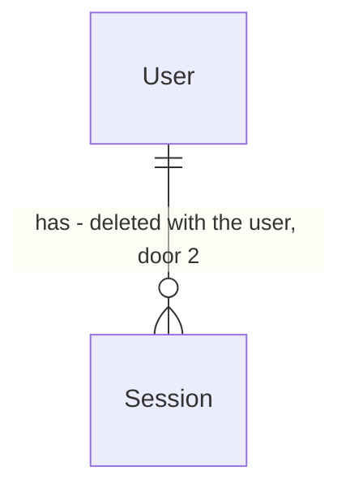

# Fase 3 — Autenticação

## Problem

Hoje qualquer pessoa que alcance a porta `3001` usa a API inteira sem se identificar. Hoje isso
significa calcular preços e disparar chamadas ao MakerWorld em nome da empresa. A partir da
Fase 5 vai significar ler e alterar custos, margens, estoque e dados de clientes. O web também
abre para qualquer um que alcance a porta `3000`. Nenhuma ação registra quem a fez. O log de
auditoria que o `CONTEXT.md` pede para as movimentações de estoque (módulo 12) não tem de onde
tirar o usuário, e a autorização por papel da Fase 4 não tem sobre o que se apoiar.

Quem paga é a empresa. Custos e margens ficam expostos a quem estiver na rede. Toda fase com
dados (5 em diante) depende desta, e o ROADMAP a coloca como pré-requisito. A fonte não traz
números de incidente. O motivo é estrutural, não um vazamento que já aconteceu.

Quando isto estiver pronto, quem abre o sistema cai na tela de login. Depois de entrar, a pessoa
vê o próprio nome no cabeçalho e um botão "Sair". A API recusa com `401` toda rota que não seja
explicitamente pública.

## Flow

Reaproveita o `ValidationPipe` (AD-003), o filtro global de erros (AD-001), o `apiFetch` do web
(AD-005) e o TypeORM com migrations (AD-002). Não entra nenhuma biblioteca de autenticação: o
hash usa `node:crypto` e o cookie é lido e escrito pelo próprio Express.

**Login**

1. `POST /auth/login` com `{ email, password }` -> `ValidationPipe` (exists) - recusa corpo inválido
2. controller de `auth` (new, no door - placement per AD-004) - chama o serviço e escreve o cookie
3. serviço de `auth` - consulta o limitador de tentativas (door 8), busca o `User` pelo e-mail normalizado (door 1) e confere a senha com o formato de hash da door 3. Com usuário e senha válidos, cria a `Session` (door 2) e apaga as sessões expiradas desse usuário
4. out: `200` com o usuário (door 6) e o `Set-Cookie` da door 4

**Toda outra requisição**

1. request -> guard global (door 5) - rota com `@Public()` passa direto. Nas demais, o guard lê o cookie `forge_session`, busca a `Session` pelo hash do token e confere a validade e se o `User` está ativo. Sem sessão válida, lança `401`
2. controller (exists) - recebe o usuário da requisição
3. out: a resposta da rota, ou `401 { error }` pelo filtro global (exists)

**Web**

1. qualquer página fora de `/login` -> guarda do shell (new, no door - placement) - chama `GET /auth/me` pelo `apiFetch` (exists, agora com `credentials: "include"`, door 7). Com `401`, redireciona para `/login?next=<caminho>`. Com o usuário, mostra o shell com o nome e o botão "Sair"
2. `/login` (new, no door) - `POST /auth/login` e depois vai para `next` ou `/`

**Inicialização**

1. bootstrap da API -> seed do admin (new, no door - placement) - com `ADMIN_EMAIL` e `ADMIN_PASSWORD` definidos e nenhum usuário com esse e-mail, cria um `User` `admin`. Senão não faz nada

## Impact

| Front | What changes |
| --- | --- |
| domain | novo termo: `User` - quem opera o sistema, com papel `admin`, `production` ou `sales` (door 1). Mora em `users`. A Fase 4 constrói o CRUD em cima dele, e as movimentações de estoque (Fase 9) guardam o usuário |
| domain | novo termo: `Session` - um login ativo, identificado pelo hash de um token opaco (door 2). Mora em `auth` |
| route | **`POST /pricing/calculate` e `POST /print-profiles/import` passam a responder `401` sem sessão.** O único consumidor é o web deste repositório, que passa a mandar o cookie na mesma mudança (door 7) |
| route | `GET /health` continua público, porque a CI e o web o chamam sem login |
| route | toda rota criada daqui em diante nasce protegida, a menos que declare `@Public()` (door 5) |
| app | o CORS sai do `main.ts` e vai para o `configureApp`, com `credentials: true` e a origem `FRONTEND_URL` (já existe), para o `main.ts` e os e2e montarem igual. O `AppModule` importa `AuthModule` e `UsersModule`. `buildTypeOrmOptions` ganha `uuidExtension: 'pgcrypto'`, para os UUIDs saírem de `gen_random_uuid()` |
| env | novas variáveis no `.env.example`: `ADMIN_NAME`, `ADMIN_EMAIL`, `ADMIN_PASSWORD`, `SESSION_COOKIE_SECURE`. O `docker-compose.yml` repassa essas quatro e o `FRONTEND_URL` ao container da API (`SESSION_COOKIE_SECURE` com padrão `false` no ambiente local) |
| tests | os e2e de `pricing` e `print-profiles` passam a entrar com um usuário antes de chamar a rota. Os testes do web que simulam o `fetch` passam a responder também o `GET /auth/me` |
| web | o layout se divide em duas partes: `/login` fica sem a navegação, e o resto fica dentro do shell protegido. O cabeçalho ganha o nome do usuário e o botão "Sair" |
| decision | a questão 3 do ROADMAP fica respondida (sessão no servidor, decisão do usuário). As doors 1, 2, 5, 6 e 7 viram entradas no `STATE.md`, porque as Fases 4+ vão copiá-las |
| stored data | nada para migrar. As tabelas `users` e `sessions` nascem vazias por migration, e o primeiro usuário vem do seed |

## Relations

One-way constraints: `User` identificado por UUID (door 1). E-mail do `User` único e guardado em
minúsculas (door 1). Papel do `User` obrigatório, com os valores `admin`, `production` e `sales`
(door 1). Hash do token da `Session` único (door 2). `Session` apagada junto com o `User`
(door 2).

## Surface

| Route | In | Out | Status |
| --- | --- | --- | --- |
| `POST /auth/login` | `email`, `password` | `id` · `name` · `email` · `role` + `Set-Cookie: forge_session` · `{ error }` | `200`, `400`, `401`, `429` |
| `POST /auth/logout` | cookie `forge_session` (opcional) | vazio + `Set-Cookie` que expira o cookie | `204` |
| `GET /auth/me` | cookie `forge_session` | `id` · `name` · `email` · `role` · `{ error }` | `200`, `401` |
| `POST /pricing/calculate` | cookie `forge_session` + corpo atual | igual ao atual · `{ error }` | `200`, `400`, `401` |
| `POST /print-profiles/import` | cookie `forge_session` + `url` | igual ao atual · `{ error }` | `200`, `400`, `401`, `404`, `502` |

## Landing

| One-way door | Literal shape | Alternative rejected |
| --- | --- | --- |
| 1. tabela `users` | `id uuid` (`gen_random_uuid()`), `email` com índice único e sempre em minúsculas sem espaços nas pontas, `role` enum do Postgres `users_role_enum ('admin', 'production', 'sales')` não nulo, `active boolean not null default true`, `password_hash text not null`, `name`, `created_at`, `updated_at` | id `serial`: a Fase 4 expõe `/users/:id`, e ids sequenciais mostram quantos usuários existem e deixam adivinhar os vizinhos. Trocar a largura do identificador depois muda todas as FKs das Fases 9+. Unicidade case-sensitive: `Ana@x.com` e `ana@x.com` virariam duas contas, e o login dependeria de maiúsculas |
| 2. tabela `sessions` | `id uuid`, `user_id uuid not null references users(id) on delete cascade`, `token_hash char(64)` com índice único (SHA-256 em hex do token), `expires_at timestamptz not null`, `created_at`. O token em claro nunca é gravado | JWT em cookie (escolha do usuário): sem tabela, o logout não revoga um token copiado, e um usuário desativado na Fase 4 continua entrando até o token expirar. Gravar o token em claro: quem ler o banco ou um backup assume qualquer sessão |
| 3. formato do hash de senha | `scrypt$N=131072,r=8,p=1$<salt base64, 16 bytes>$<hash base64, 64 bytes>` via `crypto.scrypt` do `node:crypto` (`maxmem` 256 MB), comparado com `timingSafeEqual`. Os parâmetros vão dentro da string, então dá para aumentá-los depois sem invalidar os hashes antigos | argon2 ou bcrypt (sugeridos no ROADMAP): as duas são dependências nativas compiladas por plataforma, para o que o Node já traz. O scrypt com esses parâmetros é o mínimo da OWASP. `bcrypt` ainda corta a senha em 72 bytes |
| 4. cookie de sessão | `forge_session=<32 bytes aleatórios em base64url>; HttpOnly; SameSite=Lax; Path=/; Max-Age=604800`, mais `Secure` quando `SESSION_COOKIE_SECURE` não é `false` | `SameSite=None`: exigiria `Secure` e proteção CSRF própria. As portas `3000` e `3001` de `localhost` já são o mesmo site, então `Lax` basta. `SameSite=Strict`: quem chega ao web por um link externo apareceria deslogado na primeira navegação |
| 5. autenticação por padrão (precedente) | `APP_GUARD` global que exige sessão em toda rota. Um decorator `@Public()` libera exceções, que hoje são só `GET /health`, `POST /auth/login` e `POST /auth/logout` | guard por controller (`@UseGuards` em cada um): cada rota nova das Fases 4 a 29 nasceria aberta se alguém esquecesse o decorator. O esquecimento vira falha silenciosa em vez de uma rota que responde `401` |
| 6. contrato do usuário autenticado | `{ "id": "<uuid>", "name": "Ana", "email": "ana@brios3d.com", "role": "admin" }`, igual em `POST /auth/login` e `GET /auth/me`. `password_hash`, `active` e as datas nunca saem | devolver a entidade inteira: vazaria o hash. Um objeto `{ user: … }` aninhado: nada mais vai na resposta, e a Fase 4 reusa o mesmo formato na lista de usuários |
| 7. credenciais entre web e API (precedente) | API: `enableCors({ origin: FRONTEND_URL, credentials: true })`. Web: o `apiFetch` sempre manda `credentials: "include"` | proxy do Next para a API no mesmo host: seria uma segunda camada HTTP por requisição, e o `AGENTS.md` fixa que o web chama a API por `NEXT_PUBLIC_API_URL` |
| 8. limite de tentativas de login | em memória, por e-mail normalizado: depois de 5 falhas dentro de 15 min, toda tentativa com esse e-mail responde `429` até 15 min depois da 5ª falha. Um login bem-sucedido zera a contagem | limite por IP: numa rede interna todos saem pelo mesmo IP, então um erro de digitação de uma pessoa bloquearia todo mundo. Guardar no Postgres ou no Redis: com uma instância só, não compensa a escrita extra por tentativa. `@nestjs/throttler`: dependência nova para um contador que cabe num `Map` |

- Nada mais nesta mudança é difícil de reverter

## Criteria

### S1: entrar e sair pela API (P1)

Um usuário cadastrado troca e-mail e senha por uma sessão em cookie, e o logout encerra essa
sessão.

**Acceptance Criteria**

1. WHEN `POST /auth/login` recebe o e-mail e a senha corretos de um usuário ativo THEN the system SHALL responder `200` com `{ id, name, email, role }` desse usuário e um `Set-Cookie` `forge_session` com `HttpOnly`, `SameSite=Lax`, `Path=/` e `Max-Age=604800`
2. WHEN o e-mail do login chega com maiúsculas ou espaços nas pontas (`"  Ana@Brios3D.com "`) THEN the system SHALL autenticar o usuário `ana@brios3d.com`
3. IF a senha está errada, o e-mail não existe ou o usuário está inativo THEN the system SHALL responder `401` com `{ "error": "E-mail ou senha inválidos" }` e sem `Set-Cookie`
4. IF o e-mail do login não existe THEN the system SHALL comparar a senha com um hash de referência antes de responder, para o tempo de resposta não revelar quais e-mails existem
5. IF o corpo do login não tem `email` com formato de e-mail, não tem `password` em texto não vazio, tem `password` com mais de 256 caracteres ou traz outras chaves THEN the system SHALL responder `400` com `{ error }`
6. The system SHALL guardar a senha só no formato `scrypt$N=131072,r=8,p=1$<salt>$<hash>` e o token de sessão só como SHA-256 em hex. Nenhum dos dois é gravado em claro
7. WHEN o login é bem-sucedido THEN the system SHALL apagar as sessões expiradas desse usuário
8. WHEN `POST /auth/logout` recebe um cookie de sessão válido THEN the system SHALL apagar essa sessão, responder `204` e mandar um `Set-Cookie` que expira `forge_session`
9. WHEN `POST /auth/logout` chega sem cookie ou com uma sessão que não existe THEN the system SHALL responder `204` do mesmo jeito
10. WHEN a sessão encerrada no logout é usada de novo em `GET /auth/me` THEN the system SHALL responder `401`

**Independent test:** `curl -i -c jar -X POST localhost:3001/auth/login -H 'content-type: application/json' -d '{"email":"<admin>","password":"<senha>"}'`, depois `curl -b jar localhost:3001/auth/me`, depois o logout e o `me` de novo.

### S2: a API exige sessão (P1)

Toda rota que não é explicitamente pública responde `401` sem sessão válida.

**Acceptance Criteria**

11. WHEN `GET /auth/me` recebe um cookie de sessão válido THEN the system SHALL responder `200` com `{ id, name, email, role }` do dono da sessão, sem `password_hash`, `active` nem datas
12. IF `POST /pricing/calculate`, `POST /print-profiles/import` ou `GET /auth/me` chega sem cookie, com um token que não existe ou com uma sessão expirada THEN the system SHALL responder `401` com `{ "error": "Sessão expirada ou inexistente. Entre novamente" }` sem executar a rota
13. IF a sessão é válida, mas o usuário dela foi desativado THEN the system SHALL responder `401` com a mesma mensagem do AC 12
14. WHEN `POST /pricing/calculate` e `POST /print-profiles/import` recebem um cookie de sessão válido THEN the system SHALL responder como antes desta fase (`200` com o mesmo corpo)
15. WHILE não há cookie de sessão the system SHALL responder `200` em `GET /health`
16. The system SHALL exigir sessão em toda rota que não declara `@Public()`, inclusive numa rota nova que não mencione autenticação
17. WHEN 7 dias se passam desde o login THEN the system SHALL tratar a sessão como expirada (AC 12), sem renovar o prazo a cada uso

**Independent test:** `curl -i -X POST localhost:3001/pricing/calculate` sem cookie devolve `401`, e com o cookie do S1 devolve `200`.

### S3: limite de tentativas de login (P1)

Senhas erradas repetidas para o mesmo e-mail bloqueiam novas tentativas por 15 minutos.

**Acceptance Criteria**

18. WHEN o mesmo e-mail acumula 5 logins com falha dentro de 15 min THEN the system SHALL responder `429` com `{ "error": "Muitas tentativas de login. Tente novamente em 15 minutos" }` a partir da 6ª tentativa, mesmo com a senha certa
19. WHEN passam 15 min desde a 5ª falha THEN the system SHALL aceitar de novo o login com a senha certa (`200`)
20. WHEN um login dá certo antes da 5ª falha THEN the system SHALL zerar a contagem desse e-mail
21. The system SHALL contar as falhas pelo e-mail normalizado (AC 2), inclusive para um e-mail que não existe, e as falhas de um e-mail não afetam outro

**Independent test:** com o relógio injetado, 5 logins com senha errada, o 6º com a senha certa devolve `429`. Avançando o relógio 15 min, devolve `200`.

### S4: primeiro admin pelo ambiente (P1)

A API cria o primeiro administrador ao subir, sem sobrescrever nada que já exista.

**Acceptance Criteria**

22. WHEN a API sobe com `ADMIN_EMAIL` e `ADMIN_PASSWORD` definidos e nenhum usuário com esse e-mail THEN the system SHALL criar um usuário ativo com papel `admin`, o e-mail normalizado e o nome `ADMIN_NAME` (ou `"Administrador"` sem ele)
23. WHEN a API sobe e já existe um usuário com o `ADMIN_EMAIL` THEN the system SHALL manter o nome, o papel, o `active` e o hash de senha desse usuário sem alteração
24. IF `ADMIN_EMAIL` ou `ADMIN_PASSWORD` não estão definidos THEN the system SHALL subir sem criar usuário e registrar um aviso no log dizendo que o seed foi ignorado
25. IF `ADMIN_PASSWORD` tem menos de 12 caracteres THEN the system SHALL recusar a inicialização com a mensagem `"ADMIN_PASSWORD precisa ter pelo menos 12 caracteres"`

**Independent test:** subir a API duas vezes com o mesmo `.env` e contar os usuários (`1`). Trocar a senha no `.env` e conferir que o login continua com a senha antiga.

### S5: tela de login (P1)

`/login` troca e-mail e senha pela sessão e leva a pessoa aonde ela queria ir.

**Acceptance Criteria**

26. WHEN a página `/login` abre sem sessão THEN the system SHALL mostrar os campos "E-mail" e "Senha" e o botão "Entrar", sem a navegação lateral
27. WHILE o login está em andamento the system SHALL mostrar "Entrando…" no botão e desabilitá-lo
28. IF a API responde erro ao login (`401`, `429`, `400`) THEN the system SHALL mostrar a mensagem do `{ error }` na tela e manter o e-mail digitado
29. IF a API não responde THEN the system SHALL mostrar "Não foi possível conectar à API" na tela de login
30. WHEN o login dá certo e a URL tem `next` começando com uma única `/` THEN the system SHALL ir para esse caminho. Sem `next`, ou com `next` absoluto ou começando com `//`, the system SHALL ir para `/`
31. WHEN `/login` abre com uma sessão válida THEN the system SHALL redirecionar para `/`

**Independent test:** abrir `/login`, errar a senha (mensagem na tela), acertar e cair em `/`.

### S6: páginas protegidas e logout no web (P1)

Toda página fora de `/login` só aparece com sessão, e o cabeçalho mostra quem está logado.

**Acceptance Criteria**

32. WHEN uma página fora de `/login` (ex.: `/print-profiles`) abre sem sessão THEN the system SHALL redirecionar para `/login?next=%2Fprint-profiles` sem mostrar o conteúdo da página
33. WHILE a sessão está sendo conferida the system SHALL mostrar "Carregando…" no lugar do conteúdo da página
34. IF a conferência da sessão falha porque a API não responde THEN the system SHALL mostrar "Não foi possível conectar à API" e um botão "Tentar novamente", sem redirecionar para o login
35. WHEN a sessão é válida THEN the system SHALL mostrar a página, a navegação lateral e, no cabeçalho, o nome do usuário e o botão "Sair"
36. WHEN o usuário clica em "Sair" e a API responde `204` THEN the system SHALL ir para `/login`
37. IF o logout falha porque a API não responde THEN the system SHALL mostrar "Não foi possível sair. Tente novamente" e continuar na página
38. IF uma chamada à API numa página protegida responde `401` (ex.: a sessão expirou durante a importação do MakerWorld) THEN the system SHALL redirecionar para `/login?next=<caminho atual>`

**Independent test:** sem cookie, abrir `/print-profiles` e cair no login. Entrar e voltar para `/print-profiles` com o nome no cabeçalho. Clicar em "Sair" e voltar ao login. Repetir com a API parada.

## Out of scope

| Excluded | Why |
| --- | --- |
| CRUD de usuários, `@Roles()` e respostas `403` | Fase 4 |
| Trocar a própria senha | Fase 4 |
| Recuperar a senha por e-mail | o sistema não envia e-mail, e o admin redefine a senha na Fase 4 |
| Cadastro aberto (sign-up) | só o admin cria usuários (Fase 4) |
| Login social, SSO e 2FA | o `CONTEXT.md` não pede |
| "Lembrar de mim" e renovação da sessão a cada uso | a sessão tem prazo fixo de 7 dias (AC 17) |
| Listar e encerrar as sessões ativas de um usuário | a Fase 4 pode fazer isso ao desativar um usuário. Nesta fase, o AC 13 já corta o acesso |
| Log de auditoria das ações | o usuário já fica disponível na requisição, e o log nasce com as movimentações de estoque (Fase 9) |

## Assumptions

| Assumption | Chosen default | Rationale | Confirmed? |
| --- | --- | --- | --- |
| Estratégia de sessão (questão 3) | sessão no servidor com token opaco em cookie `HttpOnly` (doors 2 e 4) | decisão do usuário ao revisar o rascunho: revogação imediata no logout e na desativação | y |
| Proteção contra força bruta | limite em memória por e-mail (door 8, S3) | decisão do usuário ao revisar o rascunho | y |
| Duração da sessão | 7 dias fixos desde o login, sem renovação | sistema interno usado todo dia. Uma semana evita logins diários sem deixar um cookie esquecido valendo para sempre | n |
| `Secure` no cookie | ligado por padrão. O `.env.example` traz `SESSION_COOKIE_SECURE=false` para o desenvolvimento local em `http` | o padrão seguro vale quando a variável é esquecida em produção | n |
| Onde o web confere a sessão | no cliente, pelo `GET /auth/me` no shell, sem `proxy.ts` | em produção a API pode ficar em outro host, e o cookie dela não chega ao servidor do Next. A documentação do Next 16 também não recomenda o proxy como autorização completa (`01-getting-started/16-proxy.md`) | n |
| Log | `Logger` do Nest registra login bem-sucedido, falha (com o e-mail normalizado e o motivo: senha, e-mail inexistente, inativo) e bloqueio `429`. Nunca registra a senha nem o token | é o único jeito de perceber um ataque ou um usuário travado | n |
| Senha do seed no `.env.example` | `ADMIN_EMAIL=admin@brios3d.local` e `ADMIN_PASSWORD=` vazio, o que faz o seed ser ignorado (AC 24) até alguém definir uma senha | um valor de exemplo preenchido viraria a senha real de quem copia o arquivo sem ler | n |
| CSRF | sem token CSRF. O cookie `SameSite=Lax` não vai em `POST` vindo de outro site, e a API só aceita JSON | as portas `3000` e `3001` do mesmo host são o mesmo site, e os domínios de produção também (linha abaixo) | n |
| Domínios de produção | web em `https://forge.brios3d.com.br` e API em `https://api.brios3d.com.br` (AD-012). O cookie fica só no host da API (sem atributo `Domain`), com `Secure`, e `FRONTEND_URL` é `https://forge.brios3d.com.br` | decisão do usuário. `.com.br` é sufixo público, então os dois hosts compartilham o domínio registrável `brios3d.com.br` e são o mesmo site: `SameSite=Lax` e o CORS com credenciais funcionam como no `localhost` | y |

**Open questions:** none - all resolved or logged above.

## Observable

| Surface | Decision | Landing |
| --- | --- | --- |
| API `POST /auth/login` | response shape | AC 1, AC 11 (door 6) |
| API `POST /auth/login` | error shape and codes | AC 3, AC 5, AC 18 |
| API `POST /auth/login` | who may call it | AC 16 - público por `@Public()` |
| API `POST /auth/login` | rate limit | AC 18, AC 19, AC 20, AC 21 |
| API `POST /auth/logout` | response shape and codes | AC 8, AC 9 |
| API `GET /auth/me` | response shape | AC 11 |
| API `GET /auth/me` | error shape and codes | AC 12, AC 13 |
| API `POST /pricing/calculate`, `POST /print-profiles/import` | who may call it | AC 12, AC 14 |
| all new `/auth/*` | versioning | n/a - o projeto não versiona rotas, e o único consumidor é o web deste repositório |
| API `GET /auth/me`, `POST /auth/logout`, rotas protegidas | rate limit | n/a - o projeto não limita taxa fora do login. Cada chamada exige uma sessão válida, e só o login testa senhas |
| screen `/login` | empty state | AC 26 |
| screen `/login` | loading state | AC 27 |
| screen `/login` | error state | AC 28, AC 29 |
| screen `/login` | unauthorised state | AC 31 - quem já tem sessão sai do login |
| screen `/login` | density and ordering | n/a - dois campos e um botão |
| screen `/login` | destructive action confirms | n/a - não há ação destrutiva |
| screen shell protegido (todas as páginas fora de `/login`) | loading state | AC 33 |
| screen shell protegido | error state | AC 34, AC 37 |
| screen shell protegido | unauthorised state | AC 32, AC 38 |
| screen shell protegido | empty state | n/a - o shell não tem lista. O estado vazio de cada página continua sendo dela (ex.: AC 26 e 28 da Fase 2) |
| screen shell protegido | density and ordering | n/a - só acrescenta o nome e o botão "Sair" ao cabeçalho |
| screen shell protegido | destructive action confirms | n/a - "Sair" não apaga dados e se desfaz entrando de novo |

## Sources

- `ROADMAP.md`, Fase 3 e questões 2 e 3 - tarefas, critérios de aceite e a observação sobre as origens `3000`/`3001`
- Respostas do usuário em 2026-09-21 - sessão no servidor, limite de tentativas no login e os domínios de produção (`forge.brios3d.com.br` e `api.brios3d.com.br`)
- `web/node_modules/next/dist/docs/01-app/01-getting-started/16-proxy.md` - o proxy do Next 16 é só para checagem otimista, não para autorização completa
