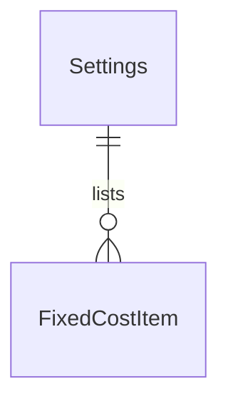

# Fase 5 — Configurações globais e canais de venda

## Problem

Hoje os parâmetros da calculadora (`pricing`) só existem como campos soltos que quem chama
`POST /pricing/calculate` precisa digitar toda vez: tarifa de kWh, hora de trabalho, margem
padrão, % falha, % purga, custo de manutenção, custos fixos mensais e as taxas de cada canal de
venda. Não há um lugar único onde esses valores da empresa fiquem guardados, então cada
orçamento futuro (Fase 16) e a calculadora integrada (Fase 12) não têm de onde puxar um
default - o usuário teria que redigitar a mesma tarifa de energia e a mesma margem em todo
cálculo. O ROADMAP (Fase 5) e o CONTEXT (`## Configurações globais`) já descrevem os campos; o
que falta é o módulo `settings` que os persiste e a entidade `SalesChannel` que guarda os canais
(balcão, Instagram/WhatsApp, Mercado Livre, Shopee, loja própria) com sua % de imposto e % de
taxa, hoje inexistente no schema.

Quando isso existir, um admin altera a tarifa de energia uma vez e ela fica disponível para
todo o sistema; vendas e produção enxergam os mesmos parâmetros (já que ambos chegam à
calculadora desde a Fase 4) sem poder editá-los.

## Flow

Reaproveita o `AuthGuard`/`RolesGuard` globais (Fase 3/4) e o `ValidationPipe` global (Fase 0);
nenhuma rota nova nasce sem essa proteção. `pricing.controller.ts`/`pricing.service.ts` (Fase 1)
não são tocados - a Fase 5 só grava configuração, a integração com o cálculo é a Fase 12.

`single module - settings` (dois controllers dentro dele, porque o ROADMAP lista `settings` como
um dos 17 módulos e não lista `sales-channels` separadamente):

1. `GET/PATCH /settings` -> `SettingsController` (novo) -> `SettingsService` (novo) - lê/atualiza
   a linha única de `Settings` e a lista de `FixedCostItem` (door 1, door 2)
2. `GET/POST/PATCH /sales-channels` (door 3) -> `SalesChannelsController` (novo) ->
   `SalesChannelsService` (novo) - lê/cria/atualiza linhas de `SalesChannel`, validando contra
   `Settings.defaultMarginRate` no momento da escrita
3. Web: `/settings` e `/sales-channels` (novas páginas) chamam `apiFetch` (existe, `web/src/lib/api.ts`)
   e reaproveitam os estados de carregamento/erro do padrão de `users/page.tsx`; `AppShell`
   (existe) ganha dois itens de menu visíveis só para `admin`

## Impact

| Front | O que muda |
| --- | --- |
| domain | termo novo: `Settings` - configuração global única da calculadora, mora no módulo `settings` |
| domain | termo novo: `SalesChannel` - canal de venda persistido (nome, % imposto, % taxa, ativo), mora no módulo `settings` |
| domain | termo existente: `channels` em `PricingInput.channels` (Fase 1) continua sendo uma lista solta no corpo de `POST /pricing/calculate` - a Fase 5 não muda esse contrato nem o `pricing.controller.ts`/`pricing.service.ts`; quem chama a calculadora hoje segue digitando os canais à mão. A Fase 12 é quem vai ler `SalesChannel` para pré-preencher esse campo |
| stored data | nada para migrar (tabelas novas); a migration semeia a linha única de `Settings` com defaults e os 5 canais do CONTEXT, para o app nunca subir com a configuração ausente |

## Relations

`SalesChannel` é uma entidade separada, sem relação de FK com `Settings` (a validação cruzada
com `defaultMarginRate` acontece na aplicação, não no banco).

One-way constraints: `fixed_cost_items.settings_id` not null (door 1), `sales_channels.name`
unique, comparado após `trim()` (door 3). Nenhum tipo ou coluna além disso.

## Surface

| Route | In | Out | Status |
| --- | --- | --- | --- |
| `GET /settings` | — | `energyTariffCentsPerKwh`, `laborCentsPerHour`, `defaultMarginRate`, `failureRate`, `purgeRate`, `maintenanceCentsPerHour`, `productiveHoursPerMonth`, `fixedCostItems: {id, name, monthlyCents}[]` | `200`, `401` |
| `PATCH /settings` | subconjunto dos campos acima; `fixedCostItems` quando presente substitui a lista inteira | mesmo formato do `GET` | `200`, `400`, `401`, `403` |
| `GET /sales-channels` | — | `{id, name, taxRate, feeRate, active}[]` (inclui inativos) | `200`, `401` |
| `POST /sales-channels` | `name`, `taxRate`, `feeRate` | `{id, name, taxRate, feeRate, active}` | `201`, `400`, `401`, `403`, `409` |
| `PATCH /sales-channels/:id` | subconjunto de `name`, `taxRate`, `feeRate`, `active` | `{id, name, taxRate, feeRate, active}` | `200`, `400`, `401`, `403`, `404`, `409` |

## Landing

| One-way door | Literal shape | Alternative rejected |
| --- | --- | --- |
| Linha única de `Settings` | id fixo `00000000-0000-0000-0000-000000000101`, criado pela migration com valores default; `SettingsService` sempre lê/grava essa linha (`findOneByOrFail({ id: SETTINGS_ID })`), nunca cria uma segunda | tabela chave-valor (`settings_kv(key, value)`) - perde a tipagem por coluna que o resto do schema usa (DTO 1:1 com coluna) e adiciona uma indireção sem ganho para uma empresa só |
| `fixedCostItems` sem CRUD dedicado | `PATCH /settings` aceita `fixedCostItems` opcional; quando vem, o serviço apaga todas as linhas de `fixed_cost_items` e insere a lista enviada, na mesma transação dos outros campos | endpoints `/settings/fixed-cost-items` (CRUD próprio) - a Fase 6 é quem introduz o padrão reutilizável de CRUD do projeto; duplicar um agora, para uma lista de poucos itens nomeados, cria um segundo padrão que ninguém pediu ainda |
| `sales_channels.name` único | `@Column({ unique: true })` sobre o nome após `trim()`; violação vira `409` (`ConflictException`), reaproveitando `isUniqueViolation` da Fase 4 | sem restrição de unicidade - um canal duplicado divide a fonte de verdade de imposto/taxa que a Fase 12 (calculadora) e a Fase 16 (orçamentos) vão consumir |

## Criteria

### S1: Leitura de configurações e canais por qualquer papel autenticado (P1)

Todo papel logado enxerga os parâmetros da calculadora e a lista de canais, sem poder editar.

**Acceptance Criteria**

1. WHEN `GET /settings` é chamado com sessão válida de qualquer papel THEN a API SHALL responder
   `200` com `energyTariffCentsPerKwh`, `laborCentsPerHour`, `defaultMarginRate`, `failureRate`,
   `purgeRate`, `maintenanceCentsPerHour`, `productiveHoursPerMonth` e `fixedCostItems`
2. IF `GET /settings` é chamado sem sessão THEN a API SHALL responder `401 { error }`
3. WHEN `GET /sales-channels` é chamado com sessão válida de qualquer papel THEN a API SHALL
   responder `200` com todos os canais, incluindo os inativos
4. IF `GET /sales-channels` é chamado sem sessão THEN a API SHALL responder `401 { error }`
5. The API SHALL semear, via migration, a linha única de `Settings` com `energyTariffCentsPerKwh: 0`,
   `laborCentsPerHour: 0`, `defaultMarginRate: 0`, `failureRate: 0`, `purgeRate: 0`,
   `maintenanceCentsPerHour: 0`, `productiveHoursPerMonth: 1`, `fixedCostItems: []`, e exatamente
   os 5 canais do CONTEXT (balcão, Instagram/WhatsApp, Mercado Livre, Shopee, loja própria), cada
   um com `taxRate: 0`, `feeRate: 0`, `active: true`

**Independent test:** logar como `production` ou `sales` e chamar `GET /settings` e
`GET /sales-channels` sem passar por nenhuma tela.

### S2: Edição das configurações globais, só admin (P1)

**Acceptance Criteria**

6. WHEN `PATCH /settings` é chamado por um admin com um subconjunto válido dos campos THEN a API SHALL persistir só os campos enviados e responder `200` com o objeto completo atualizado
7. IF `PATCH /settings` é chamado por `production` ou `sales` THEN a API SHALL responder `403`
8. IF `PATCH /settings` é chamado sem sessão THEN a API SHALL responder `401 { error }`
9. IF `PATCH /settings` envia `defaultMarginRate`, `failureRate` ou `purgeRate` fora de `[0, 1]`, ou `defaultMarginRate >= 1` THEN a API SHALL responder `400 { error }` sem persistir nada
10. IF `PATCH /settings` envia `energyTariffCentsPerKwh`, `laborCentsPerHour` ou `maintenanceCentsPerHour` negativo, ou `productiveHoursPerMonth <= 0` THEN a API SHALL responder `400 { error }` sem persistir nada
11. IF `PATCH /settings` envia corpo vazio (`{}`) THEN a API SHALL responder `400 { error: "Informe ao menos um campo para alterar" }`
12. WHEN `PATCH /settings` envia `fixedCostItems` THEN a API SHALL substituir a lista inteira (remover os itens antigos, gravar os novos) na mesma transação dos demais campos do PATCH
13. IF um item de `fixedCostItems` tem `name` vazio, maior que 60 caracteres, ou `monthlyCents` negativo THEN a API SHALL responder `400 { error }` sem persistir nenhuma alteração do PATCH

**Independent test:** logar como admin, alterar `energyTariffCentsPerKwh` sozinho, depois
`fixedCostItems` sozinho, e conferir os dois com `GET /settings`.

### S3: Gestão dos canais de venda, só admin (P1)

**Acceptance Criteria**

14. WHEN `POST /sales-channels` é chamado por um admin com `name`, `taxRate`, `feeRate` válidos THEN a API SHALL criar o canal com `active: true` e responder `201`
15. IF `POST /sales-channels` resulta em `defaultMarginRate` atual + `taxRate` + `feeRate >= 1` THEN a API SHALL responder `400 { error }` sem criar o canal
16. IF `POST /sales-channels` reusa um `name` já cadastrado (comparado após `trim()`) THEN a API SHALL responder `409 { error }`
17. IF `POST /sales-channels` é chamado por `production` ou `sales` THEN a API SHALL responder `403`
18. IF `POST /sales-channels` é chamado sem sessão THEN a API SHALL responder `401 { error }`
19. WHEN `PATCH /sales-channels/:id` altera `name`, `taxRate`, `feeRate` ou `active` por um admin THEN a API SHALL persistir só os campos enviados e responder `200`
20. IF `PATCH /sales-channels/:id` é chamado sem sessão THEN a API SHALL responder `401 { error }`
21. IF `PATCH /sales-channels/:id` renomeia para um `name` já usado por outro canal (comparado após `trim()`) THEN a API SHALL responder `409 { error }` sem persistir
22. IF `PATCH /sales-channels/:id` resulta em `defaultMarginRate` atual + `taxRate` + `feeRate >= 1` (usando o valor final de cada campo, alterado ou não) THEN a API SHALL responder `400 { error }` sem persistir
23. IF `PATCH /sales-channels/:id` é chamado por `production` ou `sales` THEN a API SHALL responder `403`
24. IF `PATCH /sales-channels/:id` referencia um id inexistente THEN a API SHALL responder `404`
25. IF `PATCH /sales-channels/:id` recebe um id que não é UUID THEN a API SHALL responder `400`
26. IF duas criações concorrentes de `sales-channels` usam o mesmo `name` THEN a API SHALL persistir exatamente um canal e responder `409` para as demais

**Independent test:** logar como admin, criar um canal novo, editar sua `taxRate`, desativá-lo,
e conferir cada passo com `GET /sales-channels`.

### S4: Tela de configurações (P2)

**Acceptance Criteria**

27. WHEN a tela `/settings` carrega THEN o web SHALL mostrar "Carregando…" até `GET /settings` responder
28. IF `GET /settings` falha THEN o web SHALL mostrar a mensagem de erro com um botão "Tentar novamente"
29. WHILE o papel logado é `admin` a tela `/settings` SHALL mostrar um formulário editável para todos os campos e persistir a alteração via `PATCH /settings` ao salvar, sem recarregar a página
30. WHILE o papel logado não é `admin` a tela `/settings` SHALL mostrar os mesmos valores sem nenhum campo editável nem botão de salvar

**Independent test:** abrir `/settings` como `sales` (só leitura) e como `admin` (edita e salva),
com Playwright.

### S5: Tela de canais de venda (P2)

**Acceptance Criteria**

31. WHEN a tela `/sales-channels` carrega THEN o web SHALL listar os canais com nome, % imposto, % taxa e situação (ativo/inativo)
32. IF `GET /sales-channels` falha THEN o web SHALL mostrar a mensagem de erro com um botão "Tentar novamente"
33. WHILE o papel logado é `admin` a tela `/sales-channels` SHALL mostrar um formulário para criar canal e controles de editar/ativar/desativar cada linha, sem recarregar a página ao usá-los
34. WHILE o papel logado não é `admin` a tela `/sales-channels` SHALL mostrar a lista sem formulário de criação nem controles de edição
35. The web SHALL adicionar os itens "Configurações" e "Canais de venda" ao menu (`AppShell`), visíveis só quando `role === "admin"`

**Independent test:** abrir `/sales-channels` como `production` (só leitura, sem menu de admin
correspondente para ele) e como `admin` (cria, edita, desativa), com Playwright.

## Out of scope

| Excluído | Por quê |
| --- | --- |
| Preço mínimo por pedido (global ou por canal) | não está na lista de tarefas da Fase 5 do ROADMAP (questão em aberto 8); fica para quando for decidido |
| Taxa fixa por venda de um canal (ex.: tarifa fixa do Mercado Livre) | a Fase 5 só pede `% imposto` e `% taxa`; tarifa fixa é a questão em aberto 9, ainda sem decisão |
| Imposto vindo do enquadramento fiscal | é a Fase 28; até lá o `% imposto` por canal configurado aqui é o valor usado (questão em aberto 10) |
| `% falha` derivado de falhas reais | é a Fase 20; aqui o valor é só manual |
| `productiveHoursPerMonth` calculado a partir das impressoras | é posterior à Fase 7; aqui é manual |
| Manutenção por impressora (em vez de um valor global) | `printers` só nasce na Fase 7; a Fase 5 não tem como oferecer a opção ainda |
| Ligar `pricing.calculate` para ler `Settings`/`SalesChannel` automaticamente | é a Fase 12 (calculadora integrada); a Fase 5 só grava a configuração |

## Assumptions

| Assumption | Chosen default | Rationale | Confirmed? |
| --- | --- | --- | --- |
| Canais além dos 5 seeds | admin pode criar novos canais (CRUD completo, sem apagar fisicamente) | a tarefa da Fase 5 não proíbe, o custo extra é baixo (mesma entidade, um `POST` a mais) e segue o precedente de `users` (Fase 4); fácil de restringir depois se o revisor preferir editar-só | n |
| `PATCH /settings` reavaliando canais existentes | não revalida canais já cadastrados quando `defaultMarginRate` muda - só a escrita do próprio canal valida a soma | mantém o admin livre para ajustar a margem; a Fase 12 vai validar a combinação real no momento do cálculo (mesmo padrão do `PricingError`, AD-008) | n |
| Concorrência em `PATCH /settings` | sem lock otimista; a última escrita vence | tela de configuração interna, de baixo tráfego, um admin por vez na prática | n |
| Semear canais com `taxRate`/`feeRate` zerados | os 5 canais nascem com 0% e o admin preenche o valor real depois | o ROADMAP e o CONTEXT não dão os percentuais reais de cada canal | n |
| Nomes duplicados de canal | únicos após `trim()`, sem normalizar maiúsculas/minúsculas | nome de canal aparece como rótulo na tela (Fase 16+); normalizar case como no e-mail não tem o mesmo motivo (não é usado para login/identidade) | n |
| Valores default da linha única de `Settings` | todos os percentuais e valores em centavos nascem `0`, `productiveHoursPerMonth` nasce `1` (o mínimo que passa em `IsPositive`, evitando divisão por zero futura) e `fixedCostItems` nasce vazio | mesmo raciocínio dos canais: são placeholders óbvios que o admin substitui ao configurar o sistema pela primeira vez; o ROADMAP não dá valores reais | n |

**Open questions:** none - todas resolvidas ou registradas acima.

## Observable

| Surface | Decision | Landing |
| --- | --- | --- |
| screen `/settings` | loading state | AC 27 |
| screen `/settings` | error state | AC 28 |
| screen `/settings` | empty state | n/a - a migration sempre semeia a linha única, nunca existe "nenhuma configuração" |
| screen `/settings` | unauthorised (papel sem permissão) | AC 30 - some o formulário, mantém a leitura (a rota já é protegida por sessão via `AuthGate`, existente) |
| screen `/settings` | ação destrutiva confirma antes | n/a - não há ação destrutiva (só edição de valores) |
| screen `/sales-channels` | loading state | AC 31 |
| screen `/sales-channels` | error state | AC 32 |
| screen `/sales-channels` | empty state | n/a - não há rota de apagar canal, a lista nunca fica vazia depois do seed |
| screen `/sales-channels` | unauthorised (papel sem permissão) | AC 34 |
| screen `/sales-channels` | ação destrutiva confirma antes | existente - desativar segue o mesmo padrão sem confirmação de `users/page.tsx` (reversível, um clique) |
| API `GET/PATCH /settings` | formato de erro e códigos | existente - `{ error }` (AD-001); códigos novos em AC 7-13 |
| API `GET/POST/PATCH /sales-channels` | formato de erro e códigos | existente - `{ error }` (AD-001); códigos novos em AC 15-26 |
| all new `/settings*`, `/sales-channels*` | versionamento, rate limit | n/a - nenhuma rota do projeto usa isso hoje |

## Sources

- `ROADMAP.md` (Fase 5, Fase 1, Fase 4, "Matriz de permissões", "Questões em aberto" 5-10) -
  escopo, dependências e o contrato que `pricing` já usa
- `CONTEXT.md` (`## Configurações globais`, fórmula de preço) - os campos e a lista dos 5 canais
