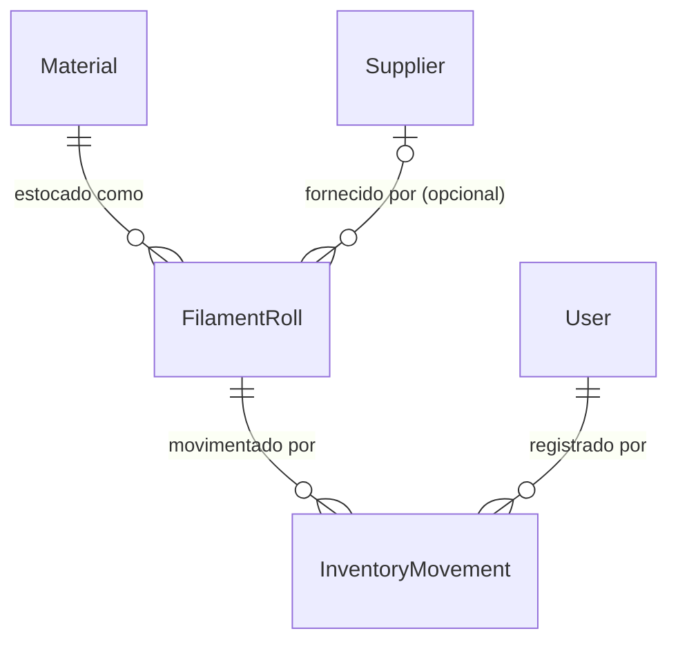

# Fase 9 — Estoque de filamento por rolo

## Problem

Hoje o sistema não sabe quanto filamento a empresa tem: não existe registro de rolo, saldo em
gramas, custo médio ou histórico de movimentação. Quem orça digita um custo por grama chutado a
cada vez (a Fase 1 recebe `costPerGram` como parâmetro solto), e ninguém sabe, olhando o sistema,
quantos rolos estão fechados, abertos, secando ou parados sem uso. A Fase 12 (calculadora
integrada) e a Fase 25 (margem real) dependem de um custo médio por material que hoje não existe
em lugar nenhum.

Quando isto for entregue: produção registra pesagem e baixa de consumo/perda/descarte de cada
rolo, admin registra a entrada manual de um rolo novo (com custo de aquisição), e o custo médio
por material passa a ser um número que o sistema calcula sozinho a partir do que está fisicamente
em estoque, auditável por usuário e data.

## Flow

Não reaproveita nada existente — é o primeiro módulo com ledger imutável do sistema. Fases 10
(insumos) e 19 (baixa de job) reusam este ledger depois.

`single module - inventory`, referenciando `Material` (Fase 6) e `Supplier` (Fase 8) por FK
(nenhuma delas ganha coluna nova).

1. Entrada manual (admin) -> `InventoryService.createRoll` (new, no door - placement per convenção dos outros services) -> valida material ativo e fornecedor existente -> persiste `FilamentRoll` (door 1) e a primeira `InventoryMovement` tipo `entrada` (door 1) na mesma transação (door 2) -> `balanceGrams` nasce igual a `initialWeightGrams`
2. Pesagem/baixa/descarte/abertura/secagem (produção) -> `InventoryService` (new, no door - placement, mesmo módulo do hop 1) -> cada ação grava uma `InventoryMovement` e atualiza `balanceGrams` (nunca negativo, door 3) na mesma transação
3. Leitura (todos os papéis) -> `InventoryService.summaryByMaterial` (new, no door - placement, mesmo módulo) -> agrega `balanceGrams` e custo por rolo direto do estado atual dos rolos, sem replay do ledger e sem coluna de cache em `Material` (door 4 e door 5) -> expõe `avgCostCentsPerGram` por material
4. Web: tela de rolos por material (lista + resumo) e tela de detalhe do rolo com o histórico de
   movimentações e os formulários de entrada, pesagem, baixa, abertura e secagem

## Impact

| Front | O que muda |
| --- | --- |
| domain | novo termo: `FilamentRoll` - um rolo físico rastreado individualmente, vive em `inventory` |
| domain | novo termo: `InventoryMovement` - lançamento imutável do ledger de estoque; a Fase 10 (roadmap) reusa esta mesma tabela/shape para insumos |
| domain | existente: `Material` - até aqui era só cadastro (tipo/marca/cor/densidade); passa a ter estoque e custo médio associados, mas **sem** ganhar coluna nova - quem quiser o custo médio consulta `GET /inventory/materials-summary`, não um campo do material |
| domain | existente: `Supplier` - ganha o primeiro consumidor por FK (antes só era listado/cadastrado); nenhuma mudança de contrato no módulo `suppliers` |
| stored data | nada a migrar - tabelas novas, sem backfill |

## Relations

One-way constraints: `FilamentRoll.materialId` FK obrigatória para `materials` (door 1);
`FilamentRoll.balanceGrams` nunca negativo, reforçado por `CHECK` no banco além da validação da
API (door 3); `InventoryMovement.rollId` FK obrigatória para `filament_rolls`;
`InventoryMovement.userId` FK obrigatória para `users`, nunca nula (door 6); nenhuma rota de
edição ou exclusão de `InventoryMovement` é exposta (ledger imutável, door 6). No columns/types
beyond what the doors below fix.

## Surface

Toda rota herda o guard global de sessão (AD-015); `401` sem cookie entra no `Status` de cada
rota abaixo mesmo sem ser um critério novo desta fase.

| Route | In | Out | Status |
| --- | --- | --- | --- |
| `POST /inventory/rolls` | `materialId`, `initialWeightGrams`, `spoolTareGrams`, `acquisitionCostCents`, `nominalWeightGrams?`, `supplierId?`, `batch?`, `purchaseDate?`, `location?` | `RollResponse` (rolo + `balanceGrams`) | `201`, `400`, `401`, `403` |
| `GET /inventory/rolls` | query `materialId?`, `status?`, `search?`, `page?`, `pageSize?` (contrato AD-020) | `{ items: RollResponse[], total, page, pageSize }` | `200`, `401` |
| `GET /inventory/rolls/:id` | - | `RollResponse` + `movements: MovementResponse[]` | `200`, `401`, `404` |
| `PATCH /inventory/rolls/:id/weigh` | `grossWeightGrams` | `RollResponse` | `200`, `400`, `401`, `403`, `404`, `409` |
| `POST /inventory/rolls/:id/movements` | `type` (`consumo` ou `perda`), `quantityGrams`, `reason?` | `RollResponse` | `201`, `400`, `401`, `403`, `404`, `409` |
| `PATCH /inventory/rolls/:id/discard` | - | `RollResponse` | `200`, `401`, `403`, `404`, `409` |
| `PATCH /inventory/rolls/:id/open` | - | `RollResponse` | `200`, `401`, `403`, `404` |
| `PATCH /inventory/rolls/:id/dry` | - | `RollResponse` | `200`, `401`, `403`, `404` |
| `GET /inventory/materials-summary` | query `search?` (nome do material) | `{ items: [{ materialId, totalBalanceGrams, avgCostCentsPerGram, rollCount }] }` | `200`, `401` |

## Landing

| One-way door | Literal shape | Alternativa rejeitada |
| --- | --- | --- |
| 1. Novas tabelas `filament_rolls` e `inventory_movements` | `filament_rolls(id uuid pk, material_id uuid not null fk, supplier_id uuid null fk, nominal_weight_grams, initial_weight_grams, balance_grams, spool_tare_grams, batch null, purchase_date null, opened_at timestamptz null, last_dried_at timestamptz null, discarded_at timestamptz null, location null, acquisition_cost_cents, created_at, updated_at)`; `inventory_movements(id uuid pk, roll_id uuid not null fk, type enum('entrada','consumo','perda','ajuste'), quantity_grams numeric (signed), unit_cost_cents_per_gram numeric null, reason text null, user_id uuid not null fk, created_at timestamptz)` | Uma única tabela `stock_movements` genérica com `entity_type`/`entity_id` polimórfico - rejeitada porque perde a FK real do banco e cada rolo já tem campos próprios (tara, secagem) que um ledger genérico não carrega |
| 2. `balanceGrams` é uma coluna materializada em `FilamentRoll`, atualizada na mesma transação de cada `InventoryMovement` | `balanceGrams` sempre escrito dentro da mesma `manager.transaction` que insere o movimento correspondente; o ledger continua sendo a fonte da verdade e permite reconciliar/recontar o saldo | Calcular o saldo por `SUM(quantity_grams)` a cada leitura - rejeitada porque a Fase 9 já pede filtro/ordenação por saldo na listagem (lento sem coluna) e o AGENTS.md aceita explicitamente "derivado ou **conciliado**" |
| 3. Saldo nunca fica negativo, reforçado por `CHECK (balance_grams >= 0)` no banco, além da validação 400 na API | `ALTER TABLE filament_rolls ADD CONSTRAINT balance_non_negative CHECK (balance_grams >= 0)`; a API captura a violação (código `23514`) e responde `400 { error }` em vez de vazar `500` | Só validar na API antes do `UPDATE` - rejeitada porque duas baixas concorrentes no mesmo rolo passam as duas na checagem da aplicação e só o banco resolve a corrida (dimensão "concorrência" do sweep) |
| 4. Custo médio por material é uma média ponderada pelo saldo **atual** dos rolos não descartados, calculada sob demanda (nunca armazenada) | `avgCostCentsPerGram(materialId) = Σ(balanceGrams_i × acquisitionCostCents_i / initialWeightGrams_i) / Σ(balanceGrams_i)` sobre rolos com `discardedAt IS NULL AND balanceGrams > 0`; `null` quando a soma dos saldos é 0 | Custo médio móvel (PMP) recalculado incrementalmente a cada entrada e guardado como escalar por material - rejeitada porque exige uma segunda fonte da verdade fora do ledger imutável, pode divergir dele, e continuaria "cobrando" o preço de um lote já totalmente consumido em vez do que está fisicamente na prateleira |
| 5. `Material` não ganha nenhuma coluna nova; custo médio só existe via `GET /inventory/materials-summary` | Nenhum campo em `materials` referencia estoque ou custo; a Fase 12 lê o resumo do módulo `inventory` | Guardar `avgCostCentsPerGram` como coluna cacheada em `Material` - rejeitada pelo mesmo motivo do door 4 (segunda fonte da verdade) e porque acopla o cadastro (Fase 6) ao estoque (Fase 9), que o ROADMAP trata como módulos separados |
| 6. `status` do rolo é derivado em runtime (`discardedAt` -> `descartado`; senão `balanceGrams === 0` -> `vazio`; senão `openedAt` setado -> `aberto`; senão `fechado`), não é uma coluna própria; nenhuma rota de update/delete existe para `InventoryMovement` | Mapper `toRollResponse` deriva `status` a partir de `openedAt`/`balanceGrams`/`discardedAt`; o ledger só recebe `INSERT` | Coluna `status` própria escrita por cada ação - rejeitada porque pode dessincronizar do saldo real (ex.: uma baixa zera o saldo mas esquece de marcar `vazio`), e a Fase 11 (alertas) e a Fase 19 (escolha do rolo) passam a poder filtrar direto por `balance_grams`/`discarded_at` em vez de confiar num enum solto |

## Criteria

### S1: Entrada manual de rolo (P1)

Admin cadastra um rolo novo com custo de aquisição; o rolo nasce com saldo cheio e a primeira
movimentação do ledger.

**Acceptance Criteria**

1. WHEN um admin envia `POST /inventory/rolls` com `materialId`, `initialWeightGrams > 0`, `spoolTareGrams >= 0` e `acquisitionCostCents >= 0` válidos THEN o sistema SHALL criar o `FilamentRoll` com `balanceGrams = initialWeightGrams`, gravar uma `InventoryMovement` tipo `entrada` com `quantityGrams = initialWeightGrams` e `unitCostCentsPerGram = acquisitionCostCents / initialWeightGrams`, e responder `201` com o rolo criado
2. IF `materialId` não corresponde a um material existente e ativo THEN o sistema SHALL responder `400 { error }` sem criar nada
3. IF `supplierId` for enviado e não corresponder a um fornecedor existente THEN o sistema SHALL responder `400 { error }`
4. IF `initialWeightGrams <= 0`, `spoolTareGrams < 0` ou `acquisitionCostCents < 0` THEN o sistema SHALL responder `400 { error }`
5. IF a criação da `InventoryMovement` falhar depois do `FilamentRoll` já persistido em memória THEN o sistema SHALL desfazer a criação do rolo (mesma transação) e responder `500` genérico, sem deixar um rolo órfão sem movimento de entrada
6. WHEN `production` ou `sales` chama `POST /inventory/rolls` THEN o sistema SHALL responder `403`

**Independent test:** criar um rolo via API e conferir o rolo e o movimento de entrada gerado.

### S2: Saldo e custo médio por material (P1)

Qualquer papel autenticado vê, por material, quanto tem em estoque e a quanto sai o grama hoje.

**Acceptance Criteria**

7. WHEN `GET /inventory/rolls` é chamado com `materialId` THEN o sistema SHALL retornar só os rolos daquele material, paginados no contrato de `page`/`pageSize`/`total` (AD-020)
8. WHEN `GET /inventory/materials-summary` é chamado THEN, para cada material com pelo menos um rolo, o sistema SHALL retornar `totalBalanceGrams` (soma de `balanceGrams` dos rolos não descartados) e `avgCostCentsPerGram` igual à média ponderada pelo saldo atual (door 4)
9. WHEN dois rolos do mesmo material são criados com `acquisitionCostCents` diferentes THEN `avgCostCentsPerGram` do resumo SHALL ser a média ponderada pelos dois saldos (caso de referência numérico no teste)
10. IF um material não tem nenhum rolo com `balanceGrams > 0` não descartado THEN `avgCostCentsPerGram` SHALL ser `null`

**Independent test:** entrar dois rolos com custos diferentes do mesmo material e conferir o
resumo.

### S3: Pesagem (P1)

Produção pesa um rolo em uso e o saldo é corrigido por um movimento de ajuste.

**Acceptance Criteria**

11. WHEN produção (ou admin) envia `PATCH /inventory/rolls/:id/weigh` com `grossWeightGrams` THEN o sistema SHALL calcular `newBalance = grossWeightGrams - roll.spoolTareGrams`, gravar uma `InventoryMovement` tipo `ajuste` com `quantityGrams = newBalance - balanceGrams atual`, atualizar `balanceGrams = newBalance` e responder `200`
12. WHEN `grossWeightGrams = 812` e `spoolTareGrams = 250` THEN o sistema SHALL deixar `balanceGrams = 562`, com o movimento de ajuste correspondente no histórico (caso de referência do ROADMAP)
13. IF `grossWeightGrams < roll.spoolTareGrams` THEN o sistema SHALL responder `400 { error }` sem gravar movimento
14. IF o rolo está descartado (`discardedAt` setado) THEN `PATCH /inventory/rolls/:id/weigh` SHALL responder `409 { error }`
15. WHEN `sales` chama `PATCH /inventory/rolls/:id/weigh` THEN o sistema SHALL responder `403`

**Independent test:** pesar o rolo de referência e conferir o saldo e o movimento gerados.

### S4: Baixa de consumo, perda e descarte (P1)

Produção registra o que saiu do rolo sem virar impressão rastreada (a Fase 19 automatiza isso
depois), e pode descartar um rolo.

**Acceptance Criteria**

16. WHEN produção envia `POST /inventory/rolls/:id/movements` com `type` `consumo` ou `perda` e `0 < quantityGrams <= balanceGrams` THEN o sistema SHALL gravar a `InventoryMovement` correspondente com `quantityGrams` negativo, decrementar `balanceGrams` e responder `201`
17. IF `quantityGrams > balanceGrams` do rolo THEN o sistema SHALL responder `400 { error }` sem gravar nada (impedir saldo negativo)
18. WHEN duas chamadas concorrentes de baixa, cada uma válida isoladamente, juntas excederiam o saldo do rolo THEN o sistema SHALL aceitar só uma delas, e a outra SHALL responder `400 { error }`, garantido pelo `CHECK (balance_grams >= 0)` do banco (door 3)
19. WHEN produção envia `PATCH /inventory/rolls/:id/discard` em um rolo com `balanceGrams > 0` THEN o sistema SHALL gravar uma `InventoryMovement` tipo `perda` pelo saldo restante inteiro, zerar `balanceGrams` e marcar `discardedAt`, respondendo `200`
20. IF o rolo já está descartado THEN qualquer nova chamada de baixa ou descarte SHALL responder `409 { error }`

**Independent test:** dar baixa parcial, tentar exceder o saldo e descartar o restante.

### S5: Abertura e secagem (P2)

Produção registra quando um rolo foi aberto e quando foi seco, sem mexer no saldo.

**Acceptance Criteria**

21. WHEN produção envia `PATCH /inventory/rolls/:id/open` pela primeira vez THEN o sistema SHALL gravar `openedAt` com o instante atual e responder `200`
22. WHEN produção envia `PATCH /inventory/rolls/:id/open` numa segunda vez THEN o sistema SHALL manter o `openedAt` original sem alterá-lo (idempotente)
23. WHEN produção envia `PATCH /inventory/rolls/:id/dry` THEN o sistema SHALL sempre atualizar `lastDriedAt` para o instante atual (um rolo pode secar mais de uma vez)

**Independent test:** abrir e secar um rolo, repetir a abertura e conferir que `openedAt` não
muda.

### S6: Auditoria e histórico (P1)

Todo movimento mostra quem fez e quando.

**Acceptance Criteria**

24. The system SHALL gravar o `userId` de quem fez a chamada em toda `InventoryMovement`, sem exceção
25. WHEN `GET /inventory/rolls/:id` é chamado THEN o sistema SHALL retornar o histórico de movimentações ordenado por `createdAt` crescente, cada uma com `type`, `quantityGrams`, `unitCostCentsPerGram`, `reason`, `userId` e `createdAt`
26. The system SHALL nunca expor, em nenhuma rota, uma forma de editar ou apagar uma `InventoryMovement` já gravada

**Independent test:** fazer entrada + pesagem + baixa e conferir a ordem e os dados do histórico.

### S7: Telas de estoque (P1)

Web: lista de rolos por material, detalhe com histórico, e os formulários de entrada, pesagem e
baixa.

**Acceptance Criteria**

27. WHEN a tela de rolos carrega THEN o sistema SHALL mostrar um estado de carregamento e, ao concluir, a lista agrupada/filtrável por material com o saldo total e o custo médio (AC 8)
28. IF a chamada à API falhar THEN a tela de rolos SHALL mostrar um estado de erro, sem lista parcial
29. IF não houver nenhum rolo cadastrado THEN a tela SHALL mostrar um estado vazio com a ação de cadastrar (visível só para admin)
30. WHEN `production` ou `sales` está logado THEN a tela SHALL esconder a ação de entrada manual de rolo (só admin cria)
31. WHEN `sales` está logado THEN a tela de detalhe do rolo SHALL esconder os formulários de pesagem, baixa, abertura e secagem (só leitura)
32. WHEN o usuário confirma o descarte de um rolo com saldo THEN a tela SHALL exigir uma confirmação explícita antes de enviar a chamada (ação destrutiva)

**Independent test:** validado com Playwright - carregamento, vazio, erro, papéis e confirmação
de descarte.

## Out of scope

Capacidades de produto, não itens de processo.

| Excluído | Por quê |
| --- | --- |
| Estoque mínimo e alertas de reposição | Fase 11 do ROADMAP |
| Etiqueta com QR code por rolo | Fase 11 do ROADMAP |
| Entrada de rolo por pedido de compra, com rateio de frete/impostos | Fase 21 do ROADMAP - a entrada desta fase é sempre manual |
| Baixa automática de filamento ao concluir um job de impressão | Fase 19 do ROADMAP - hoje a baixa é sempre manual |
| `StockItem` (insumos e peças por quantidade) | Fase 10 do ROADMAP - reusa este ledger, mas é um cadastro e uma tela separados |
| Edição de campos cadastrais do rolo após a entrada (localização, lote, fornecedor, data de compra, custo) sem passar por pesagem/baixa/abertura/secagem | Não pedido pelas tarefas do ROADMAP para esta fase; uma correção de cadastro fica para quando o produto pedir |
| % de falha real alimentada pelas perdas registradas aqui | Fase 20 do ROADMAP (`PrintFailure`) - esta fase só grava a perda, não calcula taxa |

## Assumptions

| Assumption | Chosen default | Rationale | Confirmed? |
| --- | --- | --- | --- |
| Chave de "material" no custo médio (questão 12 do ROADMAP) | Agrupar por `materialId` (a linha inteira do cadastro), que já é a combinação tipo+marca+cor da Fase 6 | O FK aponta para uma linha específica de `Material`; não há como um rolo "ser" só o tipo sem já carregar marca e cor da linha referenciada - a granularidade já está fixada pelo schema da Fase 6 | n |
| `supplierId` na entrada do rolo | Opcional | O ROADMAP lista fornecedor como um campo do rolo, mas não como obrigatório; compras informais/de balcão podem não ter fornecedor cadastrado | n |
| Material inativo bloqueia nova entrada; fornecedor inativo não bloqueia | Bloquear só por material inativo (AC 2) | Um material desativado não deveria receber novo estoque; um fornecedor pode ser desativado e o histórico de compras antigas continuar válido | n |
| Papéis do módulo `inventory` | Admin cria/entra rolo; produção faz pesagem, baixa (consumo/perda/descarte), abertura e secagem; vendas só lê | Decisão do usuário nesta sessão, seguindo o precedente de `printers` (AD-018): ação com dado financeiro fica só com admin, ação operacional de chão de fábrica tem rota dedicada liberada a produção | y |
| Fórmula de custo médio ponderado | Média ponderada pelo saldo **atual** dos rolos não descartados (door 4), não um PMP incremental guardado | Deriva sempre do estado atual do ledger, sem uma segunda fonte da verdade que possa dessincronizar; "recalculado a cada entrada" já vale porque a soma muda assim que um rolo novo existe | n |
| `status` do rolo | Campo derivado em runtime, não uma coluna própria (door 6) | Evita dessincronizar de `balanceGrams`/`openedAt`/`discardedAt`; a Fase 11 e a Fase 19 podem filtrar direto pelos fatos em vez de um enum solto | n |
| Reabrir (`/open`) e resecar (`/dry`) várias vezes | `/open` é idempotente (mantém o primeiro `openedAt`); `/dry` sempre atualiza `lastDriedAt` | Um rolo só é aberto uma vez na vida, mas pode secar várias vezes ao longo do uso | n |

**Open questions:** none - all resolved or logged above.

## Observable

| Surface | Decision | Landing |
| --- | --- | --- |
| screen `rolls list` | empty state | AC 29 |
| screen `rolls list` | loading state | AC 27 |
| screen `rolls list` | error state | AC 28 |
| screen `rolls list` | unauthorised state | n/a - rota já exige sessão (AD-015); os três papéis podem ler |
| screen `rolls list` | densidade e ordenação | AC 27 - agrupado/filtrável por material |
| screen `rolls list` | ação destrutiva confirma antes | n/a - nenhuma ação destrutiva nesta tela (fica no detalhe) |
| screen `roll detail` | empty state | n/a - um rolo sempre nasce com a movimentação de entrada (AC 1), histórico nunca vazio |
| screen `roll detail` | loading state | AC 27 (mesmo padrão da lista) |
| screen `roll detail` | error state | AC 28 (mesmo padrão da lista) |
| screen `roll detail` | unauthorised state | n/a - mesma regra da lista |
| screen `roll detail` | ação destrutiva confirma antes | AC 32 (descarte) |
| screen `roll detail` | densidade e ordenação do histórico | AC 25 - `createdAt` crescente |
| all `/inventory/rolls*`, `/inventory/materials-summary` | error shape e códigos | AD-001, ACs 2-4/13/14/17/20 |
| all `/inventory/rolls*`, `/inventory/materials-summary` | quem pode chamar | ACs 6/15/30/31 (matriz de papéis) |
| all `/inventory/rolls*`, `/inventory/materials-summary` | versionamento, rate limit | n/a - nenhum outro módulo do sistema versiona rota ou aplica rate limit |
| command ou scheduled task | - | n/a - nenhum comando/job nesta fase |
| documento ou copy | - | n/a - nenhum texto de leitura externa nesta fase |
| coleção `rolls` | critério de agrupamento | AC 7/27 - por `materialId` |
| coleção `rolls` | duplicados | n/a - vários rolos do mesmo material coexistindo é o propósito da fase |
| coleção `rolls` | exceção que não se encaixa | AC 8/9 - rolo descartado ou com saldo zero some do resumo de custo médio mas continua visível na lista/histórico |

## Sources

- `ROADMAP.md` Fase 9 (Estoque de filamento por rolo) - objetivo, tarefas e critérios de aceite
- `.specs/STATE.md` AD-001, AD-006, AD-007, AD-014, AD-015, AD-018, AD-020, AD-021 - contratos de erro, dinheiro, uuid, autenticação/autorização, paginação e componentes CRUD que esta fase segue
